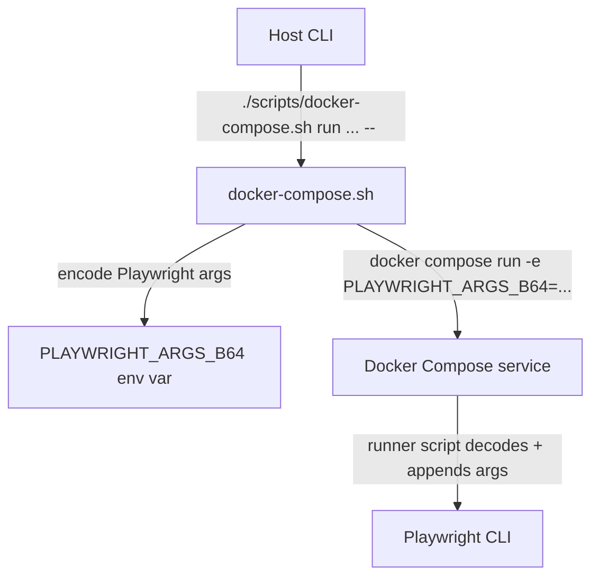

# Local Playwright Docker Runner

This folder hosts the shared Playwright runner image and Docker Compose services
used for local E2E and VRT testing.

The `scripts/docker-compose.sh` wrapper runs Docker Compose with the repo-local
file.

The compose setup bind-mounts the repo. It uses an entrypoint that aligns
container UID/GID with your host (`PUID`/`PGID`) and fixes ownership of
`node_modules`/`.pnpm-store` before dropping privileges.

## CI Usage

GitHub Actions runs Playwright tests inside the `mcr.microsoft.com/playwright:v1.55.0-noble`
job container. In CI we do not use Docker Compose or bind mounts; the workflow
installs dependencies with pnpm and executes the existing test scripts inside
the container.

## Structure

- `docker/playwright/Dockerfile` - Base image with browsers baked in.
- `docker/docker-compose.yml` - Local services for component and app tests.
- `docker/.dockerignore` - Build ignore list (symlinked at repo root).

## Common Commands

### Package Scripts (Recommended)

Run component library E2E tests:

```bash
pnpm --filter @ongov/ontario-design-system-component-library run test:e2e:docker
```

Run Next.js E2E tests:

```bash
pnpm --filter app-nextjs run test:e2e:docker
```

Run Next.js VRT tests:

```bash
pnpm --filter app-nextjs run test:vrt:docker
```

Package script examples with forwarded Playwright args:

```bash
pnpm --filter @ongov/ontario-design-system-component-library run test:e2e:docker -- -- ontario-accordion.e2e.ts
pnpm --filter @ongov/ontario-design-system-component-library run test:e2e:docker -- -- tests/components/accordion/
pnpm --filter app-nextjs run test:e2e:docker -- -- --grep="accordion"
```

Note: quoted arguments with spaces are supported (use `--grep="pattern"`). Short `-g` expects a separate argument, not `-g=pattern`.

Note: when using package scripts, you may see `-- --` because the first `--` is for `pnpm run` and the second `--` is the delimiter that `scripts/docker-compose.sh` uses to forward Playwright args. You can avoid the double dash by using `--playwright-args`:

```bash
pnpm --filter @ongov/ontario-design-system-component-library run test:e2e:docker -- --playwright-args ontario-accordion.e2e.ts
```

Note: prefer `pnpm --filter ... run test:e2e:docker` when forwarding `--grep` with spaces. The `lerna run` shortcut (`pnpm test:e2e:stencil:docker`) can split quoted args.

Common Playwright argument examples (forwarded to the container):

| Target                    | Command Example                                                                                                                | Description                                                             |
| :------------------------ | :----------------------------------------------------------------------------------------------------------------------------- | :---------------------------------------------------------------------- |
| **Entire Suite (File)**   | `pnpm --filter @ongov/ontario-design-system-component-library run test:e2e:docker -- -- ontario-accordion.e2e.ts`              | Runs every test defined in that specific file.                          |
| **Specific Test (Title)** | `pnpm --filter @ongov/ontario-design-system-component-library run test:e2e:docker -- -- --grep="should expand on click"`       | Uses grep to run only tests with titles matching that string.           |
| **Specific Test (Line)**  | `pnpm --filter @ongov/ontario-design-system-component-library run test:e2e:docker -- -- ontario-accordion.e2e.ts:42`           | Executes the exact test starting on line 42 of that file.               |
| **Folder/Directory**      | `pnpm --filter @ongov/ontario-design-system-component-library run test:e2e:docker -- -- tests/components/accordion/`           | Runs all E2E files located within a specific directory.                 |
| **By Tag**                | `pnpm --filter @ongov/ontario-design-system-component-library run test:e2e:docker -- -- --grep="@smoke"`                       | Runs tests containing the `@smoke` tag in their title or configuration. |
| **Specific Browser**      | `pnpm --filter @ongov/ontario-design-system-component-library run test:e2e:docker -- -- --grep="accordion" --project=chromium` | Runs matching tests only in the Chromium environment.                   |

### Direct Docker Compose (Advanced)

Build the Playwright runner image:

```bash
./scripts/docker-compose.sh build app-vrt-runner
```

Run component library E2E tests:

```bash
./scripts/docker-compose.sh run --rm stencil-e2e-runner
```

Run Next.js E2E tests:

```bash
./scripts/docker-compose.sh run --rm app-e2e-runner
```

Run Next.js VRT tests:

```bash
./scripts/docker-compose.sh run --rm app-vrt-runner
```

Pass extra Playwright arguments (for a single test, grep, etc.):

```bash
./scripts/docker-compose.sh run --rm stencil-e2e-runner -- tests/ontario-accordion.e2e.ts
./scripts/docker-compose.sh run --rm app-e2e-runner -- --grep="accordion"
./scripts/docker-compose.sh run --rm app-vrt-runner --playwright-args --project=chromium
```

Flow: CLI options to Playwright



## Cleaning Volumes

Remove only the volumes created by this setup (safer default):

```bash
docker volume rm \
  node_modules_root pnpm_store \
  node_modules_app_angular node_modules_app_nextjs node_modules_app_react \
  node_modules_app_web_components_documentation \
  node_modules_component_library node_modules_component_library_angular node_modules_component_library_react \
  node_modules_complete_styles node_modules_design_tokens node_modules_global_styles
```

Last resort: remove all unused Docker volumes on your machine:

```bash
docker volume prune
```
