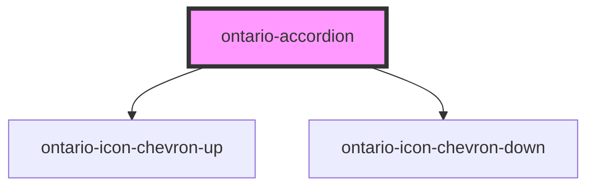

# ontario-accordion

<!-- Auto Generated Below -->

## Properties

| Property        | Attribute         | Description | Type                    | Default                              |
| --------------- | ----------------- | ----------- | ----------------------- | ------------------------------------ |
| `accordionData` | `accordion-data`  |             | `Accordion[] \| string` | `undefined`                          |
| `ariaLabelText` | `aria-label-text` |             | `string`                | `'Expand or collapse the accordion'` |
| `isOpen`        | `is-open`         |             | `boolean`               | `false`                              |
| `label`         | `label`           |             | `string`                | `'Expand/Collapse'`                  |
| `name`          | `name`            |             | `string`                | `'Accordion Title'`                  |

## Dependencies

### Depends on

- [ontario-icon-chevron-up](../ontario-icon)
- [ontario-icon-chevron-down](../ontario-icon)

### Graph

---

_Built with [StencilJS](https://stenciljs.com/)_
