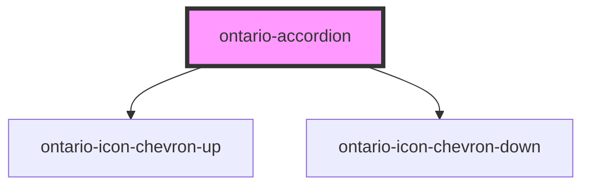

# ontario-accordion

Use accordions to provide a show/hide option for sections of content on complex pages.

## Usage guidance

Please refer to the [Ontario Design System](https://designsystem.ontario.ca/components/detail/accordions.html) for current documentation guidance for accordions.

## Configuration

Once the component package has been installed (see Ontario Design System Component Library for installation instructions), the accordion component can be added directly into the project's code, and can be customized by updating the properties outlined [here](#properties). Please see the [examples](#examples) below for how to configure the component.

## Examples

Example of an accordion component, where the user is explicitly passing in content through the `accordionData` property.

```html
<ontario-accordion
	title="My Accordion"
	open-label="Expand all"
	close-label="Collapse all"
	accordion-data='[
	    {"label": "Accordion 1", "content": ["Item 1", "Item 2", "Item 3"]},
	    {"label": "Accordion 2", "content": ["Item A", "Item B", "Item C"]}
	  ]'
></ontario-accordion>
```

This is another example of an acc. This time, the content is passed as a child of the `ontario-aside` component, which allows for HTML content to be passed. A `highlightColour` option is also passed.

<!-- Auto Generated Below -->

## Properties

| Property        | Attribute         | Description | Type                    | Default                              |
| --------------- | ----------------- | ----------- | ----------------------- | ------------------------------------ |
| `accordionData` | `accordion-data`  |             | `Accordion[] \| string` | `undefined`                          |
| `ariaLabelText` | `aria-label-text` |             | `string`                | `'Expand or collapse the accordion'` |
| `isOpen`        | `is-open`         |             | `boolean`               | `false`                              |
| `label`         | `label`           |             | `string`                | `'Expand/Collapse'`                  |
| `name`          | `name`            |             | `string`                | `'Accordion Title'`                  |

## Dependencies

### Depends on

- [ontario-icon-chevron-up](../ontario-icon)
- [ontario-icon-chevron-down](../ontario-icon)

### Graph



---

_Built with [StencilJS](https://stenciljs.com/)_
