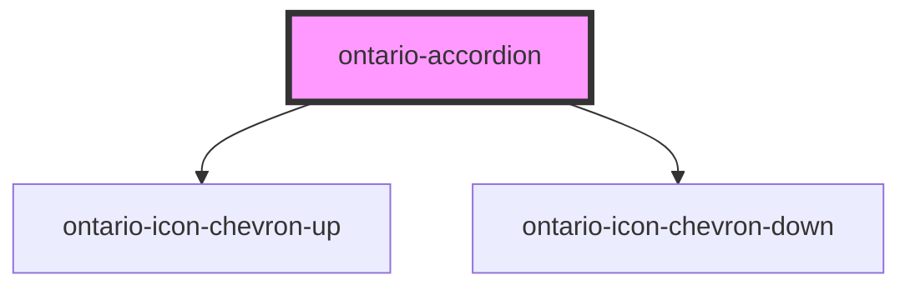

import { OntarioAccordion } from '@ongov/ontario-design-system-component-library-react';

# ontario-accordion

Use accordions to provide a show/hide option for sections of content on complex pages.

## Usage guidance

Please refer to the [Ontario Design System](https://designsystem.ontario.ca/components/detail/accordions.html) for current documentation guidance for accordions.

## Configuration

Once the component package has been installed (see Ontario Design System Component Library for installation instructions), the accordion component can be added directly into the project's code, and can be customized by updating the properties outlined [here](#properties). Please see the [examples](#examples) below for how to configure the component.

## Examples

Example of an accordion component, where the user is explicitly passing in content through the `accordionData` property.

```html
<ontario-accordion
	title="My Accordion"
	expand-collapse-button='{
		"expandAllSectionsLabel": "Expand All",
		"collapseAllSectionsLabel": "Collapse All"
	}'
	accordion-data='[
	    {"label": "Accordion 1", "content": "This is a string"},
		{"label": "Accordion 2", "accordionContentType": "html", "content": "<ul><li>List A</li><li>List B</li><li>List C</li></ul>"}
	]'
></ontario-accordion>
```

<div>
	<OntarioAccordion
		title="My Accordion"
		expand-collapse-button='{
			"expandAllSectionsLabel": "Expand All",
			"collapseAllSectionsLabel": "Collapse All"
		}'
		accordion-data='[
			{"label": "Accordion 1", "content": "This is a string"},
			{"label": "Accordion 2", "accordionContentType": "html", "content": "<ul><li>List A</li><li>List B</li><li>List C</li></ul>"}
		]'
	></OntarioAccordion>
</div>

## Custom property types

### Accordion

```typescript
accordion-data='[ {"label": "Accordion 1", "content": "Text Context"}, {"label": "Accordion 2", "content": "Text Content"}]'
```

| Property               | Description                                                                                                                                   | Type                 | Default  |
| ---------------------- | --------------------------------------------------------------------------------------------------------------------------------------------- | -------------------- | -------- |
| `label`                | The label for the individual accordion button.                                                                                                | `string`             |          |
| `accordionContentType` | The content type of the accordion. If the accordion requires multiple lines or HTML, the `accordionContentType` prop should be set to `html`. | `'string' \| 'html'` | `string` |
| `content`              | The content that is passed into each accordion.                                                                                               | `string`             |
| `isOpen`               | A boolean to track whether the accordion is expanded or collapsed.                                                                            | `string`             |
| `ariaLabelText`        | Custom Aria Label text for the section.                                                                                                       | `string`             |

### ExpandCollapseButtonDetails

By default, the component uses our recommended values for the Expand/Collapse button label, which will automatically match the language the component is in. However, if custom values for this button are required they can be set via the `expandCollapseButton` property.

```typescript
expand-collapse-button='{ "expandAllSectionsLabel": "Expand All", "collapseAllSectionsLabel": "Collapse All" }'
```

| Property                   | Description                              | Type     |
| -------------------------- | ---------------------------------------- | -------- |
| `expandAllSectionsLabel`   | The label for the 'Expand all' button.   | `string` |
| `collapseAllSectionsLabel` | The label for the 'Collapse all' button. | `string` |
| `ariaLabelText`            | Alt text for the expand/close button.    | `string` |

### AccordionChangeDetail

This event detail type is emitted by the `accordionChange` event whenever an individual accordion item's open state changes. It provides context about what changed, which indexes are open, and why the event occurred.

| Property       | Description                                                   | Type                                                               |
| -------------- | ------------------------------------------------------------- | ------------------------------------------------------------------ | ----------- |
| `openIndexes`  | Array of indexes currently open.                              | `number[]`                                                         |
| `changedIndex` | The index that was just toggled (if applicable).              | `number`                                                           | `undefined` |
| `isBulk`       | True if triggered by a “Expand All” or “Collapse All” action. | `boolean`                                                          | `undefined` |
| `reason`       | Describes what triggered the event.                           | [`AccordionChangeDetailReason`](#accordionchangedetailreason-enum) |

### AccordionChangeDetailReason (enum)

This enum defines the possible values for the reason property in the event payload.

| Enum Member | Value          | Description                                                 |
| ----------- | -------------- | ----------------------------------------------------------- |
| `Init`      | `'init'`       | Emitted when the component first initializes.               |
| `ToggleOne` | `'toggle-one'` | Emitted when a single accordion item is toggled.            |
| `ToggleAll` | `'toggle-all'` | Emitted when all accordion items are expanded or collapsed. |

## Technical Note: SSR (Server-Side Rendering) Considerations

The Ontario Accordion component supports multiple languages via the `language` prop, which controls the text used in translatable UI elements (e.g., button labels). If no language is explicitly passed, it defaults to English (`'en'`).

On the client side, the component also listens for global language change events such as `setAppLanguage` and `headerLanguageToggled`, allowing it to update dynamically when used in conjunction with shared application-level language controls (like `<ontario-header>`).

These language change events only fire in the browser after hydration. To ensure the correct language is rendered during SSR, it's recommended to pass the desired `language` explicitly as a prop (e.g., `<ontario-accordion language="fr"></ontario-accordion>`).

<!-- Auto Generated Below -->

## Properties

| Property               | Attribute                | Description                                                                                                                                                                                                                                             | Type                                                 | Default     |
| ---------------------- | ------------------------ | ------------------------------------------------------------------------------------------------------------------------------------------------------------------------------------------------------------------------------------------------------- | ---------------------------------------------------- | ----------- |
| `accordionData`        | `accordion-data`         | Used to include individual accordion data for the accordion component. Accepts an array of Accordion (@see Accordion) items or a JSON string of that array. The `content` is rendered either as plain text or HTML depending on `accordionContentType`. | `Accordion[] \| string`                              | `undefined` |
| `expandCollapseButton` | `expand-collapse-button` | Custom Expand/Collapse button text.                                                                                                                                                                                                                     | `ExpandCollapseButtonDetails \| string \| undefined` | `undefined` |
| `language`             | `language`               | The language of the component. This is used for translations, and is by default set through event listeners checking for a language property from the header. If none are passed, it will default to English.                                           | `"en" \| "fr" \| undefined`                          | `undefined` |
| `name`                 | `name`                   | The name of the accordion component. This is not optional.                                                                                                                                                                                              | `string`                                             | `undefined` |

## Events

| Event             | Description                    | Type                                 |
| ----------------- | ------------------------------ | ------------------------------------ |
| `accordionChange` | Emits when open indexes change | `CustomEvent<AccordionChangeDetail>` |

## Dependencies

### Depends on

- [ontario-icon-chevron-up](../ontario-icon)
- [ontario-icon-chevron-down](../ontario-icon)

### Graph



---

_Built with [StencilJS](https://stenciljs.com/)_
