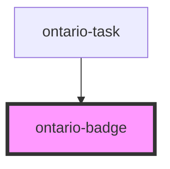

import { OntarioBadge } from '@ongov/ontario-design-system-component-library-react';

# ontario-badge

Use badges to indicate the status of a page or section.

Do not use a badge to bring a user’s attention to important content.

## Usage guidance

Please refer to the [Ontario Design System](https://designsystem.ontario.ca/components/detail/badges.html) for current documentation guidance for badges.

## Configuration

Once the component package has been installed (see Ontario Design System Component Library for installation instructions), the badge component can be added directly into the project's code, and can be customized by updating the properties outlined [here](#properties). Please see the [examples](#examples) below for how to configure the component.

## Examples

Example of a badge component, where the user is explicitly passing in content through the `label` property.

```html
<ontario-badge label="Not started"></ontario-badge>
```

<div>
	<OntarioBadge
		label="Not started"
	></OntarioBadge>
</div>

This is another example of a badge. This time, the content is passed as a child of the `ontario-badge` component. A `colour` option is also passed.

```html
<ontario-badge colour="lightTeal">Completed</ontario-badge>
```

<div>
	<OntarioBadge
		colour="lightTeal"
	>
		Completed
	</OntarioBadge>
</div>

<!-- Auto Generated Below -->

## Properties

| Property        | Attribute         | Description                                                                                                               | Type                                                                                                  | Default     |
| --------------- | ----------------- | ------------------------------------------------------------------------------------------------------------------------- | ----------------------------------------------------------------------------------------------------- | ----------- |
| `ariaLabelText` | `aria-label-text` | An aria label for screen readers. Used to provide more context to screen readers if necessary. This property is optional. | `string \| undefined`                                                                                 | `undefined` |
| `colour`        | `colour`          | The colour of the badge.                                                                                                  | `"black" \| "darkGrey" \| "green" \| "grey" \| "lightTeal" \| "red" \| "teal" \| "white" \| "yellow"` | `'teal'`    |
| `label`         | `label`           | The label for the badge. Offical guidance is to keep the label length within 15 characters.                               | `string`                                                                                              | `undefined` |

## Dependencies

### Used by

- [ontario-task](../ontario-task)

### Graph



---

_Built with [StencilJS](https://stenciljs.com/)_
