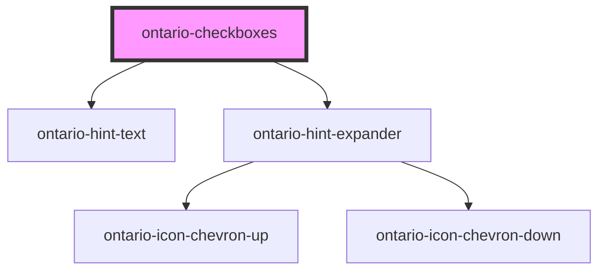

# ontario-checkbox

An interactive element which allows a user to select multiple items from a predefined list of options.

## User guidance

Please refer to the [Ontario Design System](https://designsystem.ontario.ca) for current documentation guidance.

## Configuration

Once the component package has been installed (see Ontario Design System Component Library for installation instructions), the checkbox component can be added directly into the project's code, and can be customized by updating the properties outlined [here](#properties). Please see the [examples](#examples) below for how to configure the component.

## Examples

Example of a bare-bones checkbox component, the legend for the checkbox fieldset is provided, as well as 1 checkbox option.

```html
<ontario-checkboxes
	caption="This is a question?"
	options='[{
    "name": "Checkbox 1",
    "value": "checkbox-1-value",
    "label": "Checkbox Label"
  }]'
>
</ontario-checkboxes>
```

Example of a checkbox component with multiple options, a hint text for the entire fieldset, and a hint expander on the individual option. It also has the `is-required` property set to `true`.

```html
<ontario-checkboxes
	caption="This is a question?"
	hint-text="This is the hint text"
	is-required
	options='[
    {
      "name": "Checkbox 1",
      "value": "checkbox-1-value",
      "label": "Checkbox Label"
    },
    {
      "name": "Checkbox-2",
      "value": "checkbox-2",
      "label": "checkbox-2-label",
      "hintExpander": {
        "hint": "Hint expander",
        "content": "This is the content"
      }
    }
  ]'
>
</ontario-checkboxes>
```

## Accessibility

- Do not preselect checkboxes (there should be no checked attribute by default on the checkbox)
- All checkboxes in a group should have the same name value to associate them as a group of options

<!-- Auto Generated Below -->


## Properties

| Property       | Attribute       | Description                                                                                                                                                                                                                                                                                                                                                                                        | Type                                  | Default     |
| -------------- | --------------- | -------------------------------------------------------------------------------------------------------------------------------------------------------------------------------------------------------------------------------------------------------------------------------------------------------------------------------------------------------------------------------------------------- | ------------------------------------- | ----------- |
| `caption`      | `caption`       | The text to display as the label                                                                                                                                                                                                                                                                                                                                                                   | `InputCaption \| string`              | `undefined` |
| `hintExpander` | `hint-expander` | Used to include the Hint Expander component underneath the Checkbox Legend. This is passed in as an object with key-value pairs.                                                                                                                                                                                                                                                                   | `HintExpander \| string \| undefined` | `undefined` |
| `hintText`     | `hint-text`     | Define hint text on an element.                                                                                                                                                                                                                                                                                                                                                                    | `string \| undefined`                 | `undefined` |
| `language`     | `language`      | The language of the component. This is used for translations, and is by default set through event listeners checking for a language property from the header. If none is passed, it will default to English.                                                                                                                                                                                       | `string \| undefined`                 | `'en'`      |
| `name`         | `name`          | The name for the checkboxes.                                                                                                                                                                                                                                                                                                                                                                       | `string`                              | `undefined` |
| `options`      | `options`       | Each property will be passed in through an object in the options array. This can either be passed in as an object directly (if using react), or as a string in HTML. If there are multiple checkboxes in a fieldset, each checkbox will be displayed as an option. In the example below, the options are being passed in as a string and there are two checkboxes to be displayed in the fieldset. | `CheckboxOption[] \| string`          | `undefined` |


## Events

| Event         | Description                                          | Type               |
| ------------- | ---------------------------------------------------- | ------------------ |
| `changeEvent` | Emitted when a keyboard input or mouse event occurs. | `CustomEvent<any>` |


## Dependencies

### Depends on

- [ontario-hint-text](../ontario-hint-text)
- [ontario-hint-expander](../ontario-hint-expander)

### Graph


----------------------------------------------

*Built with [StencilJS](https://stenciljs.com/)*
