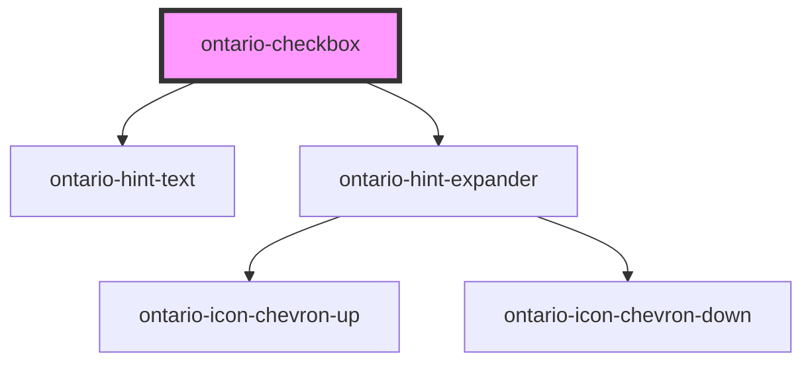

# ontario-checkbox

<!-- Auto Generated Below -->

## Properties

| Property   | Attribute   | Description                                                                                                                                                                                                                                                                                                                                                                                        | Type                                    | Default      |
| ---------- | ----------- | -------------------------------------------------------------------------------------------------------------------------------------------------------------------------------------------------------------------------------------------------------------------------------------------------------------------------------------------------------------------------------------------------- | --------------------------------------- | ------------ |
| `hintText` | `hint-text` | Define hint text on an element.                                                                                                                                                                                                                                                                                                                                                                    | `string \| undefined`                   | `undefined`  |
| `label`    | `label`     | The label text for the checkbox                                                                                                                                                                                                                                                                                                                                                                    | `string`                                | `undefined`  |
| `legend`   | `legend`    | The legend for the checkbox                                                                                                                                                                                                                                                                                                                                                                        | `string`                                | `undefined`  |
| `name`     | `name`      | The name for the checkbox (note that to group checkboxes to the same question, the name must be the same)                                                                                                                                                                                                                                                                                          | `string`                                | `undefined`  |
| `options`  | `options`   | Each property will be passed in through an object in the options array. This can either be passed in as an object directly (if using react), or as a string in HTML. If there are multiple checkboxes in a fieldset, each checkbox will be displayed as an option. In the example below, the options are being passed in as a string and there are two checkboxes to be displayed in the fieldset. | `CheckboxOption[] \| string`            | `undefined`  |
| `required` | `required`  | Used to define whether the input field is required or not. If required, the value passed should be 'required'.                                                                                                                                                                                                                                                                                     | `"optional" \| "required" \| undefined` | `"optional"` |
| `value`    | `value`     | The checkbox content value                                                                                                                                                                                                                                                                                                                                                                         | `string`                                | `undefined`  |

## Events

| Event         | Description                                          | Type               |
| ------------- | ---------------------------------------------------- | ------------------ |
| `changeEvent` | Emitted when a keyboard input or mouse event occurs. | `CustomEvent<any>` |

## Dependencies

### Depends on

- [ontario-hint-text](../ontario-hint-text)
- [ontario-hint-expander](../ontario-hint-expander)

### Graph

----------------------------------------------

*Built with [StencilJS](https://stenciljs.com/)*
