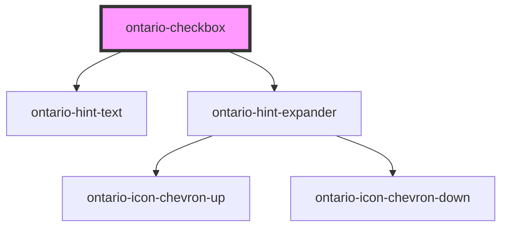

# ontario-checkbox

<!-- Auto Generated Below -->

## Properties

| Property    | Attribute    | Description                                                                                                    | Type                                    | Default      |
| ----------- | ------------ | -------------------------------------------------------------------------------------------------------------- | --------------------------------------- | ------------ |
| `elementId` | `element-id` | The ID for the checkbox                                                                                        | `string \| undefined`                   | `undefined`  |
| `hintText`  | `hint-text`  | Used to define hint text on element'.                                                                          | `string \| undefined`                   | `undefined`  |
| `label`     | `label`      | The label text for the checkbox                                                                                | `string`                                | `undefined`  |
| `legend`    | `legend`     | The legend for the checkbox                                                                                    | `string`                                | `undefined`  |
| `name`      | `name`       | The name for the checkbox (note that to group checkboxes to the same question, the name must be the same)      | `string`                                | `undefined`  |
| `options`   | `options`    | If there are multiple checkboxes, display each checkbox as an option                                           | `CheckboxOption[] \| string`            | `undefined`  |
| `required`  | `required`   | Used to define whether the input field is required or not. If required, the value passed should be 'required'. | `"optional" \| "required" \| undefined` | `"optional"` |
| `value`     | `value`      | The checkbox content value                                                                                     | `string`                                | `undefined`  |

## Events

| Event         | Description                                          | Type               |
| ------------- | ---------------------------------------------------- | ------------------ |
| `changeEvent` | Emitted when a keyboard input or mouse event occurs. | `CustomEvent<any>` |

## Dependencies

### Depends on

- [ontario-hint-text](../ontario-hint-text)
- [ontario-hint-expander](../ontario-hint-expander)

### Graph

----------------------------------------------

*Built with [StencilJS](https://stenciljs.com/)*
