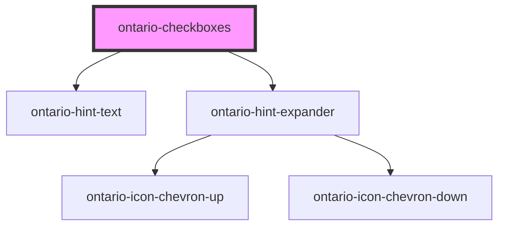

# ontario-checkbox

<!-- Auto Generated Below -->

## Properties

| Property       | Attribute       | Description                                                                                                                                                                                                                                                                                                                                                                                        | Type                                  | Default     |
| -------------- | --------------- | -------------------------------------------------------------------------------------------------------------------------------------------------------------------------------------------------------------------------------------------------------------------------------------------------------------------------------------------------------------------------------------------------- | ------------------------------------- | ----------- |
| `hintExpander` | `hint-expander` | Used to include the Hint Expander component underneath the Checkbox Legend. This is passed in as an object with key-value pairs.                                                                                                                                                                                                                                                                   | `HintExpander \| string \| undefined` | `undefined` |
| `hintText`     | `hint-text`     | Define hint text on an element.                                                                                                                                                                                                                                                                                                                                                                    | `string \| undefined`                 | `undefined` |
| `isRequired`   | `is-required`   | Determine whether the input field is required. If required, it should be set to true.                                                                                                                                                                                                                                                                                                              | `boolean`                             | `false`     |
| `legend`       | `legend`        | The legend for the checkbox                                                                                                                                                                                                                                                                                                                                                                        | `string`                              | `undefined` |
| `options`      | `options`       | Each property will be passed in through an object in the options array. This can either be passed in as an object directly (if using react), or as a string in HTML. If there are multiple checkboxes in a fieldset, each checkbox will be displayed as an option. In the example below, the options are being passed in as a string and there are two checkboxes to be displayed in the fieldset. | `CheckboxOption[] \| string`          | `undefined` |

## Events

| Event         | Description                                          | Type               |
| ------------- | ---------------------------------------------------- | ------------------ |
| `changeEvent` | Emitted when a keyboard input or mouse event occurs. | `CustomEvent<any>` |

## Dependencies

### Depends on

- [ontario-hint-text](../ontario-hint-text)
- [ontario-hint-expander](../ontario-hint-expander)

### Graph

----------------------------------------------

*Built with [StencilJS](https://stenciljs.com/)*
