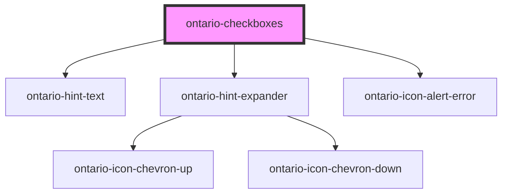

import { OntarioCheckboxes } from '@ongov/ontario-design-system-component-library-react';

# ontario-checkboxes

Use checkboxes when you want the user to select one or more options from a list.

## User guidance

Please refer to the [Ontario Design System](https://designsystem.ontario.ca/components/detail/checkboxes.html) for current documentation guidance.

## Configuration

Once the component package has been installed (see Ontario Design System Component Library for installation instructions), the checkbox component can be added directly into the project's code, and can be customized by updating the properties outlined [here](#properties). Additional information on custom types for header properties are outlined [here](#custom-property-types). Please see the [examples](#examples) below for how to configure the component.

## Examples

Example of a bare-bones checkbox component, the legend for the checkbox fieldset is provided, as well as 2 checkbox options.

```html
<ontario-checkboxes
	caption="Checkbox legend"
	name="checkboxes"
	options='[
    {
      "value": "checkbox-option-1",
      "label": "Checkbox option 1 label",
      "elementId": "checkbox-1"
    },
    {
      "value": "checkbox-option-2",
      "label": "Checkbox option 2 label",
      "elementId": "checkbox-2"
    }
  ]'
>
</ontario-checkboxes>
```

<div>
  <OntarioCheckboxes
    caption="Checkbox legend"
    name="checkboxes"
    options='[
      {
        "value": "checkbox-option-1",
        "label": "Checkbox option 1 label",
        "elementId": "checkbox-1"
      },
      {
        "value": "checkbox-option-2",
        "label": "Checkbox option 2 label",
        "elementId": "checkbox-2"
      }
    ]'
  ></OntarioCheckboxes>
</div>

Example of a checkbox component with multiple options, a hint text and hint expander for the entire checkbox group, and a hint expander on an individual option. It also has the `required` property set.

```html
<ontario-checkboxes
	caption='{
		"captionText": "Checkbox legend",
		"captionType": "large" 
	}'
	name="checkboxes"
	hint-text="Hint text for the checkbox group"
	required
	options='[
    {
      "value": "checkbox-option-1",
      "label": "Checkbox option 1 label",
      "elementId": "checkbox-1"
    },
    {
      "value": "checkbox-option-2",
      "label": "Checkbox option 2 label",
      "elementId": "checkbox-2",
      "hintExpander": {
        "hint": "Hint expander for checkbox option 2",
        "content": "Example hint expander content for checkbox option 2"
      }
    }
  ]'
>
</ontario-checkboxes>
```

<div>
  <OntarioCheckboxes
    caption='{
      "captionText": "Checkbox legend",
      "captionType": "large"
    }'
    name="checkboxes"
    hint-text="Hint text for the checkbox group"
    required
    options='[
      {
        "value": "checkbox-option-1",
        "label": "Checkbox option 1 label",
        "elementId": "checkbox-1"
      },
      {
        "value": "checkbox-option-2",
        "label": "Checkbox option 2 label",
        "elementId": "checkbox-2",
        "hintExpander": {
          "hint": "Hint expander for checkbox option 2",
          "content": "Example hint expander content for checkbox option 2"
        }
      }
    ]'
  ></OntarioCheckboxes>
</div>

### Forms

The `ontario-checkboxes` supports integration with native HTML `<form>` elements. This element integrates with the underlying browser form API and should work the same as a a group of `<input type="checkbox">` elements.

```html
<form>
	<!-- Add ontario-checkboxes -->
	<ontario-checkboxes
		caption="Checkboxes"
		name="checkboxes-1"
		required
		options='[
      {
        "value": "checkbox-option-1",
        "label": "Checkbox option 1 label",
        "elementId": "checkbox-1"
      },
      {
        "value": "checkbox-option-2",
        "label": "Checkbox option 2 label",
        "elementId": "checkbox-2"
      }
    ]'
	>
	</ontario-checkboxes>

	<!-- Submit the form with a submit button -->
	<ontario-button type="primary" html-type="submit">Submit</ontario-button>
</form>
```

Remember to set the `name` attribute as this is used to identify the field when submitting the form.

## Event model

Each event emitted by the component uses the [`CustomEvent`](https://developer.mozilla.org/en-US/docs/Web/API/CustomEvent) type to emit a custom event to help communicate what the component is doing. To access the data emitted by the component within the `CustomEvent` type use the [CustomEvent.detail](https://developer.mozilla.org/en-US/docs/Web/API/CustomEvent/detail) property.

Eg. To access the value of any change made to this component from the `checkboxOnChange` event, use the following code to wire up to listen for the the `checkboxOnChange` event.

```html
<ontario-checkboxes
	caption="Checkboxes"
	id="checkboxes-1"
	name="checkboxes-1"
	required
	options='[
      {
        "value": "checkbox-option-1",
        "label": "Checkbox option 1 label",
        "elementId": "checkbox-1"
      },
      {
        "value": "checkbox-option-2",
        "label": "Checkbox option 2 label",
        "elementId": "checkbox-2"
      }
    ]'
>
</ontario-checkboxes>
<script>
	// Note: this waits for the page and components to load before
	// locating the component.
	window.onload = () => {
		const checkboxes1 = document.getElementById('checkboxes-1');
		checkboxes1.addEventListener('checkboxOnChange', (event) => {
			console.log('OnChange detail:', event.detail);
		});
	};
</script>
```

If the first checkbox is checked within `checkboxes-1`, the value of `event.detail` is the object emitted along with the `checkboxOnChange` event.

```js
{ checked: true, id: "checkbox-1", value: "checkbox-option-1" }
```

See the [Events](#events) table to learn more about the available custom events from the component and what the type of `CustomEvent.detail` will be.

### Native `change` events

The component uses a ShadowDOM to maintain encapsulation, however, this changes how the events flow from the inside of the component to the outside in the DOM.

The native `change` event hits the ShadowDOM boundary and stops propagating. The implication of this is that it can't be listened for outside the component. To attempt to overcome this, a synthetic change event is generated and emitted. The original `change` event is available via the `detail` property on the emitted event.

When using libraries that listen for events, this process may not work with them and a workaround might be required depending on the framework or library in use.

## Custom property types

### caption

The `caption` property is used to render the legend for the ontario-checkbox. It can be passed either a string or an object. If no `captionType` needs to be specified, it can be passed as a string.

```html
caption='{ "captionText": "Checkbox legend", "captionType": "large" }'
```

| Property name | Type                               | Description                                                                                                                                          |
| ------------- | ---------------------------------- | ---------------------------------------------------------------------------------------------------------------------------------------------------- |
| `captionText` | `string`                           | Text to display as the checkbox question                                                                                                             |
| `captionType` | `"default" \| "large"\| "heading"` | The type of legend to display for the checkbox question. This is optional, and if no information is provided, it will default to the `default` type. |

### hintExpander

The `hintExpander` property is used to include the Hint Expander component underneath the checkbox legend. This is passed in as an object with key-value pairs. This is optional.

```html
hintExpander='{ "hint": "This is the hint expander title", "content": "This is the hint expander content - it is only
visible when the hint expander title (hint) is toggled" }'
```

| Property name | Type     | Description                                                                                                     |
| ------------- | -------- | --------------------------------------------------------------------------------------------------------------- |
| `hint`        | `string` | Text to display as the hint expander label/title. When toggled, it will display/hide the `hintExpander` content |
| `content`     | `string` | Text to display as the content of the hint expander                                                             |

### options

The options property will render out the different checkbox inputs and their labels. These are passed in as objects with key-value pairs, inside an array.

```html
options='[ { "value": "checkbox-option-1", "label": "Checkbox option 1 label", "elementId": "checkbox-1" }, { "value":
"checkbox-option-2", "label": "Checkbox option 2 label", "elementId": "checkbox-2", "hintExpander": { "hint": "Hint
expander for checkbox option 2", "content": "Example hint expander content for checkbox option 2" } }, ]'
```

| Property name  | Type           | Description                                                                                                                                                 |
| -------------- | -------------- | ----------------------------------------------------------------------------------------------------------------------------------------------------------- |
| `value`        | `string`       | Text to defines the value associated with the input (this is also the value that is sent on submit)                                                         |
| `label`        | `string`       | Text to display as the label of the individual checkbox option                                                                                              |
| `elementId`    | `string`       | Text used to establish a relationship between checkbox option label and the checkbox option input. This ID must be unique to the checkbox option.           |
| `hintExpander` | `hintExpander` | An optional hint expander to display for the individual checkbox option. Information on `hintExpander` properties can be found in the custom property above |

## Accessibility

- Do not preselect checkboxes (there should be no checked attribute by default on the checkbox)
- All checkboxes in a group should have the same name value to associate them as a group of options

<!-- Auto Generated Below -->

## Properties

| Property         | Attribute          | Description                                                                                                                                                                                                                                                                                                                                                                                                                            | Type                                    | Default     |
| ---------------- | ------------------ | -------------------------------------------------------------------------------------------------------------------------------------------------------------------------------------------------------------------------------------------------------------------------------------------------------------------------------------------------------------------------------------------------------------------------------------- | --------------------------------------- | ----------- |
| `caption`        | `caption`          | The text to display for the checkbox legend.                                                                                                                                                                                                                                                                                                                                                                                           | `Caption \| string`                     | `undefined` |
| `customOnBlur`   | `custom-on-blur`   | Used to add a custom function to the checkbox onBlur event.                                                                                                                                                                                                                                                                                                                                                                            | `((event: Event) => void) \| undefined` | `undefined` |
| `customOnChange` | `custom-on-change` | Used to add a custom function to the checkbox onChange event.                                                                                                                                                                                                                                                                                                                                                                          | `((event: Event) => void) \| undefined` | `undefined` |
| `customOnFocus`  | `custom-on-focus`  | Used to add a custom function to the checkbox onFocus event.                                                                                                                                                                                                                                                                                                                                                                           | `((event: Event) => void) \| undefined` | `undefined` |
| `errorMessage`   | `error-message`    | Set this to display an error message                                                                                                                                                                                                                                                                                                                                                                                                   | `string \| undefined`                   | `undefined` |
| `hintExpander`   | `hint-expander`    | Used to include the ontario-hint-expander component for the checkbox group. This is passed in as an object with key-value pairs. This is optional.                                                                                                                                                                                                                                                                                     | `HintExpander \| string \| undefined`   | `undefined` |
| `hintText`       | `hint-text`        | Used to include the ontario-hint-text component for the checkbox group. This is optional.                                                                                                                                                                                                                                                                                                                                              | `Hint \| string \| undefined`           | `undefined` |
| `language`       | `language`         | The language of the component. This is used for translations, and is by default set through event listeners checking for a language property from the header. If no language is passed, it will default to English.                                                                                                                                                                                                                    | `"en" \| "fr" \| undefined`             | `undefined` |
| `name`           | `name`             | The name for the checkboxes. The name value is used to reference form data after a form is submitted.                                                                                                                                                                                                                                                                                                                                  | `string`                                | `undefined` |
| `options`        | `options`          | The options for the checkbox group. Each property will be passed in through an object in the options array. This can either be passed in as an object directly (if using react), or as a string in HTML. If there are multiple checkboxes in a fieldset, each checkbox will be displayed as an option. In the example below, the options are being passed in as a string and there are two checkboxes to be displayed in the fieldset. | `CheckboxOption[] \| string`            | `undefined` |
| `required`       | `required`         | This is used to determine whether the checkbox is required or not. This prop also gets passed to the InputCaption utility to display either an optional or required flag in the label. If no prop is set, it will default to false (optional).                                                                                                                                                                                         | `boolean \| undefined`                  | `false`     |

## Events

| Event                | Description                                                                                  | Type                                                         |
| -------------------- | -------------------------------------------------------------------------------------------- | ------------------------------------------------------------ |
| `checkboxOnBlur`     | Emitted when a keyboard input event occurs when a checkbox option has lost focus.            | `CustomEvent<InputInteractionEvent & { focused: boolean; }>` |
| `checkboxOnChange`   | Emitted when a keyboard input or mouse event occurs when a checkbox option has been changed. | `CustomEvent<InputInteractionEvent & { checked: boolean; }>` |
| `checkboxOnFocus`    | Emitted when a keyboard input event occurs when a checkbox option has gained focus.          | `CustomEvent<InputInteractionEvent & { focused: boolean; }>` |
| `inputErrorOccurred` | Emitted when an error message is reported to the component.                                  | `CustomEvent<{ errorMessage: string; }>`                     |

## Dependencies

### Depends on

- [ontario-hint-text](../ontario-hint-text)
- [ontario-hint-expander](../ontario-hint-expander)
- [ontario-icon-alert-error](../ontario-icon)

### Graph



---

_Built with [StencilJS](https://stenciljs.com/)_
