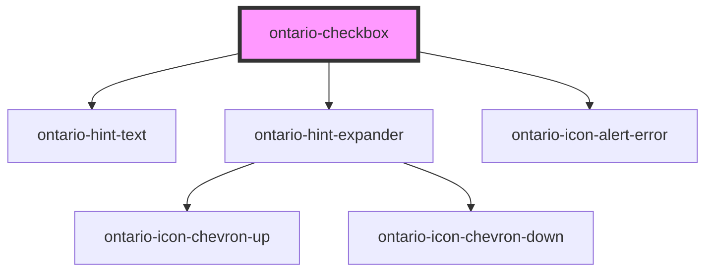

# ontario-checkbox

## Technical Note: SSR (Server-Side Rendering) Considerations

The Ontario Checkbox component supports server-side rendering, with a few considerations:

- **Language prop:** Language change events only fire in the browser after hydration. To ensure the correct language is rendered during SSR, pass the desired `language` explicitly as a prop.
- **Form participation:** This component uses the [Form-Associated Custom Elements](https://developer.mozilla.org/en-US/docs/Web/API/ElementInternals) API (`@AttachInternals`) to participate in native form submission. During SSR, it renders a single checkbox input that can support straightforward form submission when `name` and `elementId` are stable. Custom events become available after hydration.
- **Automatic required-field validation is a hydrated-only behaviour:** When `required` is set, an unchecked checkbox shows an error state (`errorMessage` and red styling) as soon as it hydrates on the client. During SSR, a required, unchecked checkbox will not yet show this error. If you need the error present in the initial server-rendered markup, pass the `error-message` prop explicitly instead. Use `required-validation-message` to customize the error text; if omitted, a translated default is used.
- **Framework guidance:** For App Router setup details, follow the [Next.js integration guide](https://designsystem.ontario.ca/developer-docs/framework-integrations/next-js-ssr/).

<!-- Auto Generated Below -->

## Overview

Ontario Checkbox collects a single boolean selection, e.g. a terms and conditions acknowledgment.

This component intentionally does not expose a `disabled` prop.

For a set of related checkbox options, use `ontario-checkboxes` instead.

To support accessible and understandable form completion:

- keep the checkbox and submission actions available
- use validation and error messaging to guide corrections

For component guidance, see:

- https://designsystem.ontario.ca/components/detail/checkboxes.html
- https://designsystem.ontario.ca/developer-docs/components/ontario-checkbox/

Disabled/read-only policy source:

- https://designsystem.ontario.ca/components/detail/buttons.html#disabled-buttons

## Properties

| Property                    | Attribute                     | Description                                                                                                                                                                                                                                                                                                                                                                    | Type                                    | Default     |
| --------------------------- | ----------------------------- | ------------------------------------------------------------------------------------------------------------------------------------------------------------------------------------------------------------------------------------------------------------------------------------------------------------------------------------------------------------------------------ | --------------------------------------- | ----------- |
| `checked`                   | `checked`                     | Whether the checkbox is checked. This is mutable and is kept in sync with user interaction.                                                                                                                                                                                                                                                                                    | `boolean \| undefined`                  | `false`     |
| `customOnBlur`              | `custom-on-blur`              | Used to add a custom function to the checkbox onBlur event.                                                                                                                                                                                                                                                                                                                    | `((event: Event) => void) \| undefined` | `undefined` |
| `customOnChange`            | `custom-on-change`            | Used to add a custom function to the checkbox onChange event.                                                                                                                                                                                                                                                                                                                  | `((event: Event) => void) \| undefined` | `undefined` |
| `customOnFocus`             | `custom-on-focus`             | Used to add a custom function to the checkbox onFocus event.                                                                                                                                                                                                                                                                                                                   | `((event: Event) => void) \| undefined` | `undefined` |
| `elementId`                 | `element-id`                  | The unique identifier of the checkbox. This is optional - if no ID is passed, one will be generated.                                                                                                                                                                                                                                                                           | `string \| undefined`                   | `undefined` |
| `errorMessage`              | `error-message`               | Set this to display an error message                                                                                                                                                                                                                                                                                                                                           | `string \| undefined`                   | `undefined` |
| `hintExpander`              | `hint-expander`               | Used to include the ontario-hint-expander component for the checkbox. This is passed in as an object with key-value pairs. This is optional.                                                                                                                                                                                                                                   | `HintExpander \| string \| undefined`   | `undefined` |
| `hintText`                  | `hint-text`                   | Used to include the ontario-hint-text component for the checkbox. This is optional.                                                                                                                                                                                                                                                                                            | `Hint \| string \| undefined`           | `undefined` |
| `label`                     | `label`                       | The text to display as the checkbox label.                                                                                                                                                                                                                                                                                                                                     | `Caption \| string`                     | `undefined` |
| `language`                  | `language`                    | The language of the component. This is used for translations, and is by default set through event listeners checking for a language property from the header. If no language is passed, it will default to English.                                                                                                                                                            | `"en" \| "fr" \| undefined`             | `undefined` |
| `name`                      | `name`                        | The name for the checkbox. The name value is used to reference form data after a form is submitted.                                                                                                                                                                                                                                                                            | `string`                                | `undefined` |
| `required`                  | `required`                    | This is used to determine whether the checkbox is required or not. This prop also gets passed to the InputCaption utility to display either an optional or required flag in the label. If no prop is set, it will default to false (optional). When required and the checkbox is unchecked, an error state is displayed automatically. It clears once the checkbox is checked. | `boolean \| undefined`                  | `false`     |
| `requiredValidationMessage` | `required-validation-message` | The message to display when the checkbox is required and left unchecked. If not provided, a translated default message is used instead.                                                                                                                                                                                                                                        | `string \| undefined`                   | `undefined` |
| `value`                     | `value`                       | The value submitted with the form data when the checkbox is checked.                                                                                                                                                                                                                                                                                                           | `string \| undefined`                   | `undefined` |

## Events

| Event                | Description                                                                             | Type                                                         |
| -------------------- | --------------------------------------------------------------------------------------- | ------------------------------------------------------------ |
| `checkboxOnBlur`     | Emitted when a keyboard input event occurs when the checkbox has lost focus.            | `CustomEvent<InputInteractionEvent & { focused: boolean; }>` |
| `checkboxOnChange`   | Emitted when a keyboard input or mouse event occurs when the checkbox has been changed. | `CustomEvent<InputInteractionEvent & { checked: boolean; }>` |
| `checkboxOnFocus`    | Emitted when a keyboard input event occurs when the checkbox has gained focus.          | `CustomEvent<InputInteractionEvent & { focused: boolean; }>` |
| `inputErrorOccurred` | Emitted when an error message is reported to the component.                             | `CustomEvent<{ errorMessage: string; }>`                     |

## Dependencies

### Depends on

- [ontario-hint-text](../ontario-hint-text)
- [ontario-hint-expander](../ontario-hint-expander)
- [ontario-icon-alert-error](../ontario-icon)

### Graph

```mermaid
graph TD;
  ontario-checkbox --> ontario-hint-text
  ontario-checkbox --> ontario-hint-expander
  ontario-checkbox --> ontario-icon-alert-error
  ontario-hint-expander --> ontario-icon-chevron-up
  ontario-hint-expander --> ontario-icon-chevron-down
  style ontario-checkbox fill:#f9f,stroke:#333,stroke-width:4px
```

---

_Built with [StencilJS](https://stenciljs.com/)_
