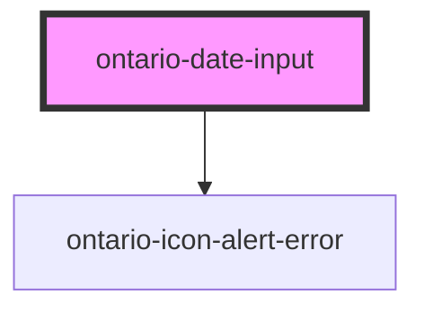

# ontario-date-input

Use this component for user-friendly date input.

## Usage guidance

Please refer to the [Ontario Design System](https://designsystem.ontario.ca/components/detail/dates.html) for current documentation guidance.

## Configuration

Once the component package has been installed (see Ontario Design System Component Library for installation instructions), the footer component can be added directly into the project's code, and can be customized by updating the properties outlined [here](#properties). Additional information on custom types for header properties are outlined [here](#custom-property-types). Please see the [examples](#examples) below for how to configure the component.

## Examples

Example of date input component

```html
<ontario-date-input
	placeholder='{
		"day": "DD",
		"month": "MM",
		"year": "YYYY"
	}'
	min-year="500"
	max-year="1000"
	required="true"
	date-options='["day", "month", "year"]'
	hint-text="For example 2000 03 01"
	caption='{
		"captionText": "Exact Date",
		"captionType": "default"
	}'
></ontario-date-input>
```

<!-- Auto Generated Below -->

## Properties

| Property        | Attribute      | Description                                                                                                                                                                                                                                                                                                     | Type                                                                                                             | Default                    |
| --------------- | -------------- | --------------------------------------------------------------------------------------------------------------------------------------------------------------------------------------------------------------------------------------------------------------------------------------------------------------- | ---------------------------------------------------------------------------------------------------------------- | -------------------------- |
| `caption`       | `caption`      | The text to display as the input label                                                                                                                                                                                                                                                                          | `Caption \| string`                                                                                              | `undefined`                |
| `dateOptions`   | `date-options` | Use to display certain date options. Example: day and month or month and year This is optional                                                                                                                                                                                                                  | `DateInputFieldType[] \| string \| undefined`                                                                    | `['day', 'month', 'year']` |
| `dateValidator` | --             | A string value explaining the date format. This is optional.                                                                                                                                                                                                                                                    | `((day: string, month: string, year: string) => DateValidatorReturnType) \| undefined`                           | `undefined`                |
| `hintText`      | `hint-text`    | A string value explaining the date format. This is optional.                                                                                                                                                                                                                                                    | `string \| undefined`                                                                                            | `undefined`                |
| `language`      | `language`     | The language of the component. This is used for translations, and is by default set through event listeners checking for a language property from the header. If none are passed, it will default to English.                                                                                                   | `"en" \| "fr" \| undefined`                                                                                      | `'en'`                     |
| `maxYear`       | `max-year`     | A number value indicating maximum value allowed for year input field of the date component. This is optional. If no prop is passed, it will default to `9999`.                                                                                                                                                  | `number \| undefined`                                                                                            | `undefined`                |
| `minYear`       | `min-year`     | A number value indicating minimum value allowed for year input field of the date component. This is optional. If no prop is passed, it will default to `1`.                                                                                                                                                     | `number \| undefined`                                                                                            | `undefined`                |
| `placeholder`   | `placeholder`  | An object value use to set Placeholder text for the day, month, and year input field. You can override all three input fields (i.e day, month, year) of the date component or none. This is optional. If no prop is passed, it will use the default placeholder text `{ day: 'DD', month: 'MM', year: 'YYYY' }` | `string \| undefined \| { day?: string \| undefined; month?: string \| undefined; year?: string \| undefined; }` | `undefined`                |
| `required`      | `required`     | A boolean value to determine whether or not the date input is required This is optional. If no prop is passed, it will default to `false`.                                                                                                                                                                      | `boolean \| undefined`                                                                                           | `false`                    |

## Events

| Event           | Description                                                                         | Type                                                                     |
| --------------- | ----------------------------------------------------------------------------------- | ------------------------------------------------------------------------ |
| `inputOnBlur`   | Emitted when a keyboard input event occurs when an input has lost focus.            | `CustomEvent<"day" \| "month" \| "year">`                                |
| `inputOnChange` | Emitted when a keyboard input or mouse event occurs when an input has been changed. | `CustomEvent<{ value: string; fieldType: "day" \| "month" \| "year"; }>` |
| `inputOnFocus`  | Emitted when a keyboard input event occurs when an input has gained focus.          | `CustomEvent<"day" \| "month" \| "year">`                                |

## Dependencies

### Depends on

- [ontario-icon-alert-error](../ontario-icon)

### Graph



---

_Built with [StencilJS](https://stenciljs.com/)_
