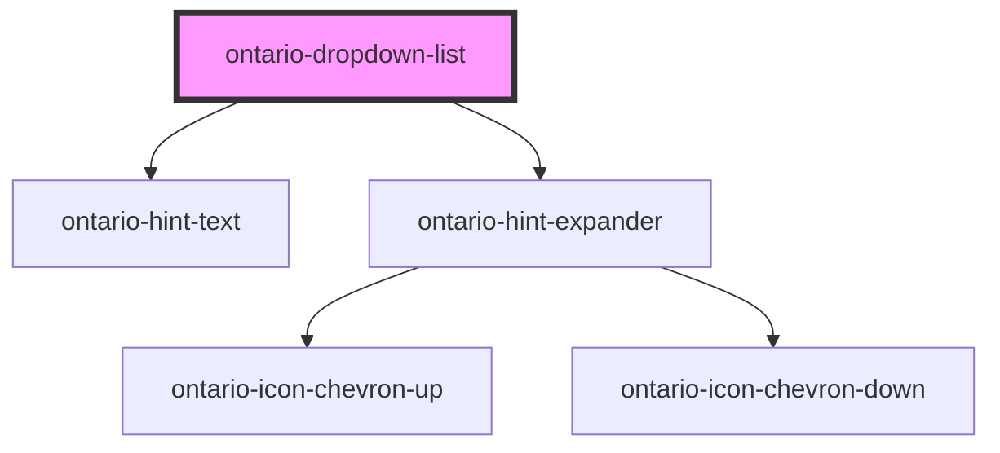

# ontario-dropdown-list

Only use a dropdown (select) list if you cannot use other form components to capture the user’s information.

## Usage Guidance

Please refer to the [Ontario Design System](https://designsystem.ontario.ca/components/detail/dropdown-lists.html) for current documentation guidance.

## Configuration

Once the component package has been installed (see Ontario Design System Component Library for installation instructions), the dropdown-list component can be added directly into the project's code, and can be customized by updating the properties outlined [here](#properties). Additional information on custom types for dropdown list properties are outlined [here](#custom-property-types). Please see the [examples](#examples) below for how to configure the component.

## Examples

Example of a dropdown list component with no `elementId` or `isEmptyStartOption` props passed. Note that by default, an ID for the `elementId` will be generated if none is provided. If no `isEmptyStartOption` prop is provided, it will default to `false` and display the first option in the `options` list.

```html
<ontario-dropdown-list
	name="streaming-service"
	caption='{
			"captionText": "Select a streaming service",
			"captionType": "default"
		}'
	required="true"
	options='[{
			"value": "netflix",
			"label": "Netflix"
		},
		{
			"value": "disney-plus",
			"label": "Disney Plus"
		},
		{
			"value": "crave",
			"label": "Crave"
		},
		{
			"value": "prime",
			"label": "Prime Video"
		}]'
>
</ontario-dropdown-list>
```

In the following example, all available props are passed through.

```html
<ontario-dropdown-list
	name="provinces-territories"
	is-empty-start-option="Select"
	element-id="provinces-territories"
	language="en"
	caption='{
			"captionText": "Province/territory",
			"captionType": "heading"
		}'
	required="true"
	options='[{
			"value": "alberta",
			"label": "Alberta"
		},
		{
			"value": "british-columbia",
			"label": "British Columbia"
		},
		{
			"value": "manitoba",
			"label": "Manitoba"
		},
		{
			"value": "new-brunswick",
			"label": "New Brunswick"
		},
		{
			"value": "newfoundland-and-labrador",
			"label": "Newfoundland and Labrador"
		},
		{
			"value": "nova-scotia",
			"label": "Nova Scotia"
		},
		{
			"value": "ontario",
			"label": "Ontario"
		},
		{
			"value": "prince-edward-island",
			"label": "Prince Edward Island"
		},
		{
			"value": "quebec",
			"label": "Quebec"
		},
		{
			"value": "saskatchewan",
			"label": "Saskatchewan"
		},
		{
			"value": "northwest-territories",
			"label": "Northwest Territories"
		},
		{
			"value": "nunavut",
			"label": "Nunavut"
		},
		{
			"value": "yukon",
			"label": "Yukon"
		}]'
>
</ontario-dropdown-list>
```

## Custom property types

### Caption

```html
caption='{ "captionText": "Province/territory", "captionType": "heading" }'
```

| **Property name** | **Type**                           | **Description**                                                                                         |
| ----------------- | ---------------------------------- | ------------------------------------------------------------------------------------------------------- |
| `captionText`     | `string`                           | The text to display as the caption (label) for the dropdown-list. This must be implemented.             |
| `captionType`     | `"default" \| "large"\| "heading"` | The type of caption to render. This is optional - if no type is passed, the "default" type will render. |

### Options

```html
options='[ { "value": "netflix", "label": "Netflix" }, { "value": "disney-plus", "label": "Disney Plus" }, { "value":
"crave", "label": "Crave" }, { "value": "prime", "label": "Prime Video" } ]'
```

| **Property name** | **Type** | **Description**                                                             |
| ----------------- | -------- | --------------------------------------------------------------------------- |
| `value`           | `string` | The dropdown option content value. Each value must be unique to the option. |
| `label`           | `string` | The text to display as the dropdown option label.                           |

## Accessibility

- An `id` attribute is necessary to allow the dropdown list to be associated with a label element. If none is provided through the `elementId` prop, one will be generated.
- A `name` attribute needs to be set to be submitted to the server when the form is submitted.
- Do not add any customized styles to dropdown lists - the browser's default is the most accessible.

<!-- Auto Generated Below -->

## Properties

| Property             | Attribute               | Description                                                                                                                                                                                                                                                                                                  | Type                                  | Default     |
| -------------------- | ----------------------- | ------------------------------------------------------------------------------------------------------------------------------------------------------------------------------------------------------------------------------------------------------------------------------------------------------------ | ------------------------------------- | ----------- |
| `caption`            | `caption`               | The text to display as the label                                                                                                                                                                                                                                                                             | `Caption \| string`                   | `undefined` |
| `elementId`          | `element-id`            | The ID for the dropdown list. If no ID is provided, one will be generated.                                                                                                                                                                                                                                   | `string \| undefined`                 | `undefined` |
| `hintExpander`       | `hint-expander`         | Used to include the Hint Expander component underneath the dropdown list box. This is passed in as an object with key-value pairs. This is optional.                                                                                                                                                         | `HintExpander \| string \| undefined` | `undefined` |
| `hintText`           | `hint-text`             | Hint text for Ontario Dropdown. This is optional.                                                                                                                                                                                                                                                            | `string \| undefined`                 | `undefined` |
| `isEmptyStartOption` | `is-empty-start-option` | Whether or not the initial option displayed is empty. If set to true, it will render the default “select” text. If set to a string, it will render the string value.                                                                                                                                         | `boolean \| string \| undefined`      | `false`     |
| `language`           | `language`              | The language of the component. This is used for translations, and is by default set through event listeners checking for a language property from the header. If none is passed, it will default to English.                                                                                                 | `"en" \| "fr" \| undefined`           | `'en'`      |
| `name`               | `name`                  | The name for the dropdown list.                                                                                                                                                                                                                                                                              | `string`                              | `undefined` |
| `options`            | `options`               | Each property will be passed in through an object in the options array. This can either be passed in as an object directly (if using react), or as a string in HTML. In the example below, the options are being passed in as a string and there are three dropdown options to be displayed in the fieldset. | `DropdownOption[] \| string`          | `undefined` |
| `required`           | `required`              | This is used to determine whether the dropdown list is required or not. This prop also gets passed to the InputCaption utility to display either an optional or required flag in the label. If no prop is set, it will default to false (optional).                                                          | `boolean \| undefined`                | `false`     |

## Dependencies

### Depends on

- [ontario-hint-text](../ontario-hint-text)
- [ontario-hint-expander](../ontario-hint-expander)

### Graph



---

_Built with [StencilJS](https://stenciljs.com/)_
