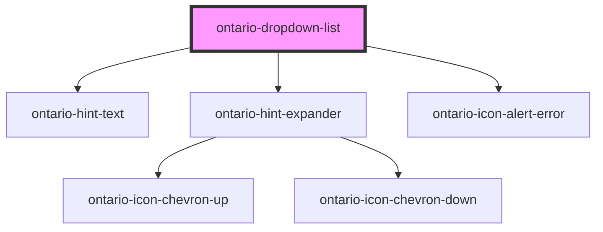

import { OntarioDropdownList } from '@ongov/ontario-design-system-component-library-react';

# ontario-dropdown-list

Only use a dropdown (select) list if you cannot use other form components to capture the user’s information.

## Usage Guidance

Please refer to the [Ontario Design System](https://designsystem.ontario.ca/components/detail/dropdown-lists.html) for current documentation guidance.

## Configuration

Once the component package has been installed (see Ontario Design System Component Library for installation instructions), the dropdown list component can be added directly into the project's code, and can be customized by updating the properties outlined [here](#properties). Additional information on custom types for dropdown list properties are outlined [here](#custom-property-types). Please see the [examples](#examples) below for how to configure the component.

## Examples

Example of a dropdown list component with no `elementId` or `isEmptyStartOption` props passed. Note that by default, an ID for the `elementId` will be generated if none is provided. If no `isEmptyStartOption` prop is provided, it will default to `false` and display the first option in the `options` list, unless one of the options has a `selected` attribute set to `true`.

```html
<ontario-dropdown-list
	name="streaming-service"
	caption='{
		"captionText": "Select a streaming service",
		"captionType": "default"
	}'
	required
	options='[{
			"value": "netflix",
			"label": "Netflix"
		},
		{
			"value": "disney-plus",
			"label": "Disney Plus"
		},
		{
			"value": "crave",
			"label": "Crave"
		},
		{
			"value": "prime",
			"label": "Prime Video"
		}]'
>
</ontario-dropdown-list>
```

<div>
	<OntarioDropdownList
		name="streaming-service"
		caption='{
			"captionText": "Select a streaming service",
			"captionType": "default"
		}'
		required
		options='[{
			"value": "netflix",
			"label": "Netflix"
		},
		{
			"value": "disney-plus",
			"label": "Disney Plus"
		},
		{
			"value": "crave",
			"label": "Crave"
		},
		{
			"value": "prime",
			"label": "Prime Video"
		}]'
	></OntarioDropdownList>
</div>

In the following example, all available props are passed through.

```html
<ontario-dropdown-list
	name="provinces-territories"
	is-empty-start-option="Select"
	element-id="provinces-territories"
	language="en"
	hint-text="Select the province or territory you currently live in."
	caption='{
		"captionText": "Province/territory",
		"captionType": "heading"
	}'
	required
	options='[{
			"value": "alberta",
			"label": "Alberta"
		},
		{
			"value": "british-columbia",
			"label": "British Columbia"
		},
		{
			"value": "manitoba",
			"label": "Manitoba"
		},
		{
			"value": "new-brunswick",
			"label": "New Brunswick"
		},
		{
			"value": "newfoundland-and-labrador",
			"label": "Newfoundland and Labrador"
		},
		{
			"value": "nova-scotia",
			"label": "Nova Scotia"
		},
		{
			"value": "ontario",
			"label": "Ontario",
			"selected": true
		},
		{
			"value": "prince-edward-island",
			"label": "Prince Edward Island"
		},
		{
			"value": "quebec",
			"label": "Quebec"
		},
		{
			"value": "saskatchewan",
			"label": "Saskatchewan"
		},
		{
			"value": "northwest-territories",
			"label": "Northwest Territories"
		},
		{
			"value": "nunavut",
			"label": "Nunavut"
		},
		{
			"value": "yukon",
			"label": "Yukon"
		}]'
>
</ontario-dropdown-list>
```

<div>
	<OntarioDropdownList
		name="provinces-territories"
		is-empty-start-option="Select"
		element-id="provinces-territories"
		language="en"
		hint-text="Select the province or territory you currently live in."
		caption='{
			"captionText": "Province/territory",
			"captionType": "heading"
		}'
		required
		options='[{
			"value": "alberta",
			"label": "Alberta"
		},
		{
			"value": "british-columbia",
			"label": "British Columbia"
		},
		{
			"value": "manitoba",
			"label": "Manitoba"
		},
		{
			"value": "new-brunswick",
			"label": "New Brunswick"
		},
		{
			"value": "newfoundland-and-labrador",
			"label": "Newfoundland and Labrador"
		},
		{
			"value": "nova-scotia",
			"label": "Nova Scotia"
		},
		{
			"value": "ontario",
			"label": "Ontario",
			"selected": true
		},
		{
			"value": "prince-edward-island",
			"label": "Prince Edward Island"
		},
		{
			"value": "quebec",
			"label": "Quebec"
		},
		{
			"value": "saskatchewan",
			"label": "Saskatchewan"
		},
		{
			"value": "northwest-territories",
			"label": "Northwest Territories"
		},
		{
			"value": "nunavut",
			"label": "Nunavut"
		},
		{
			"value": "yukon",
			"label": "Yukon"
		}]'
	></OntarioDropdownList>
</div>

### Forms

The `ontario-dropdown-list` supports integration with native HTML `<form>` elements. This element integrates with the underlying browser form API and should work the same as an `<select>`.

```html
<form>
	<!-- Add an ontario-dropdown-list -->
	<ontario-dropdown-list
		name="dropdown-1"
		is-empty-start-option="Select"
		element-id="dropdown-1"
		caption="Dropdown"
		required
		options='[{
			"value": "alberta",
			"label": "Alberta"
		},
		{
			"value": "ontario",
			"label": "Ontario",
			"selected": true
		},
		{
			"value": "quebec",
			"label": "Quebec"
		},
		{
			"value": "nunavut",
			"label": "Nunavut"
		}]'
	>
	</ontario-dropdown-list>

	<!-- Submit the form with a submit button -->
	<ontario-button type="primary" html-type="submit">Submit</ontario-button>
</form>
```

Remember to set the `name` attribute as this is used to identify the field when submitting the form.

## Event model

Each event emitted by the component uses the [`CustomEvent`](https://developer.mozilla.org/en-US/docs/Web/API/CustomEvent) type to emit a custom event to help communicate what the component is doing. To access the data emitted by the component within the `CustomEvent` type use the [CustomEvent.detail](https://developer.mozilla.org/en-US/docs/Web/API/CustomEvent/detail) property.

Eg. To access the value of any change made to this component from the `dropdownOnChange` event, use the following code to wire up to listen for the the `dropdownOnChange` event.

```html
<ontario-dropdown-list
	name="dropdown-1"
	id="dropdown-1"
	is-empty-start-option="Select"
	element-id="dropdown-1"
	caption="Dropdown"
	required
	options='[{
			"value": "ontario",
			"label": "Ontario"
		},
		{
			"value": "quebec",
			"label": "Quebec"
		}]'
></ontario-dropdown-list>
<script>
	// Note: this waits for the page and components to load before
	// locating the component.
	window.onload = () => {
		const dropdown1 = document.getElementById('dropdown-1');
		dropdown1.addEventListener('dropdownOnChange', (event) => {
			console.log('OnChange detail:', event.detail);
		});
	};
</script>
```

If an option is selected from `dropdown-1`, the value of `event.detail` is the object emitted along with the `dropdownOnChange` event.

```js
{ id: "dropdown-1", value: "ontario" }
```

See the [Events](#events) table to learn more about the available custom events from the component and what the type of `CustomEvent.detail` will be.

### Native `change` events

The component uses a ShadowDOM to maintain encapsulation, however, this changes how the events flow from the inside of the component to the outside in the DOM.

The native `change` event hits the ShadowDOM boundary and stops propagating. The implication of this is that it can't be listened for outside the component. To attempt to overcome this, a synthetic change event is generated and emitted. The original `change` event is available via the `detail` property on the emitted event.

When using libraries that listen for events, this process may not work with them and a workaround might be required depending on the framework or library in use.

## Custom property types

### Caption

```html
caption='{ "captionText": "Province/territory", "captionType": "heading" }'
```

| Property name | Type                               | Description                                                                                             |
| ------------- | ---------------------------------- | ------------------------------------------------------------------------------------------------------- |
| `captionText` | `string`                           | The text to display as the caption (label) for the dropdown-list. This must be implemented.             |
| `captionType` | `"default" \| "large"\| "heading"` | The type of caption to render. This is optional - if no type is passed, the "default" type will render. |

### Options

```html
options='[ { "value": "netflix", "label": "Netflix" }, { "value": "disney-plus", "label": "Disney Plus" }, { "value":
"crave", "label": "Crave" }, { "value": "prime", "label": "Prime Video" } ]'
```

| Property name | Type      | Description                                                                                                                                 |
| ------------- | --------- | ------------------------------------------------------------------------------------------------------------------------------------------- |
| `value`       | `string`  | The dropdown option content value. Each value must be unique to the option.                                                                 |
| `label`       | `string`  | The text to display as the dropdown option label.                                                                                           |
| `selected`    | `boolean` | A boolean value to determine whether or not the dropdown list option is pre-selected. If no selected value is set, it will be set to false. |

## Accessibility

- An `id` attribute is necessary to allow the dropdown list to be associated with a label element. If none is provided through the `elementId` prop, one will be generated.
- A `name` attribute needs to be set to be submitted to the server when the form is submitted.
- Do not add any customized styles to dropdown lists - the browser's default is the most accessible.

<!-- Auto Generated Below -->

## Properties

| Property             | Attribute               | Description                                                                                                                                                                                                                                                                                                         | Type                                    | Default     |
| -------------------- | ----------------------- | ------------------------------------------------------------------------------------------------------------------------------------------------------------------------------------------------------------------------------------------------------------------------------------------------------------------- | --------------------------------------- | ----------- |
| `caption`            | `caption`               | The text to display for the dropdown list label.                                                                                                                                                                                                                                                                    | `Caption \| string`                     | `undefined` |
| `customOnBlur`       | `custom-on-blur`        | Used to add a custom function to the dropdown onBlur event.                                                                                                                                                                                                                                                         | `((event: Event) => void) \| undefined` | `undefined` |
| `customOnChange`     | `custom-on-change`      | Used to add a custom function to the dropdown onChange event.                                                                                                                                                                                                                                                       | `((event: Event) => void) \| undefined` | `undefined` |
| `customOnFocus`      | `custom-on-focus`       | Used to add a custom function to the dropdown onFocus event.                                                                                                                                                                                                                                                        | `((event: Event) => void) \| undefined` | `undefined` |
| `elementId`          | `element-id`            | The ID for the dropdown list. If no ID is provided, one will be generated.                                                                                                                                                                                                                                          | `string \| undefined`                   | `undefined` |
| `errorMessage`       | `error-message`         | Set this to display an error message                                                                                                                                                                                                                                                                                | `string \| undefined`                   | `undefined` |
| `hintExpander`       | `hint-expander`         | Used to include the ontario-hint-expander component for the dropdown list component. This is passed in as an object with key-value pairs. This is optional.                                                                                                                                                         | `HintExpander \| string \| undefined`   | `undefined` |
| `hintText`           | `hint-text`             | Used to include the ontario-hint-text component for the dropdown list. This is optional.                                                                                                                                                                                                                            | `Hint \| string \| undefined`           | `undefined` |
| `isEmptyStartOption` | `is-empty-start-option` | This prop is used to determine whether or not the initial option displayed is empty. If set to `true`, it will render the default “select” text. If set to a string, it will render the string value.                                                                                                               | `boolean \| string \| undefined`        | `false`     |
| `language`           | `language`              | The language of the component. This is used for translations, and is by default set through event listeners checking for a language property from the header. If no language is passed, it will default to English.                                                                                                 | `"en" \| "fr" \| undefined`             | `undefined` |
| `name`               | `name`                  | The name for the dropdown list. The name value is used to reference form data after a form is submitted.                                                                                                                                                                                                            | `string`                                | `undefined` |
| `options`            | `options`               | The options for dropdown list. Each option will be passed in through an object in the options array. This can either be passed in as an object directly (if using react), or as a string in HTML. In the example below, the options are being passed in as a string and there are three dropdown options displayed. | `DropdownOption[] \| string`            | `undefined` |
| `required`           | `required`              | This is used to determine whether the dropdown list is required or not. This prop also gets passed to the InputCaption utility to display either an optional or required flag in the label. If no prop is set, it will default to false (optional).                                                                 | `boolean \| undefined`                  | `false`     |

## Events

| Event                | Description                                                                                | Type                                                                      |
| -------------------- | ------------------------------------------------------------------------------------------ | ------------------------------------------------------------------------- |
| `dropdownOnBlur`     | Emitted when a keyboard input event occurs when a dropdown list has lost focus.            | `CustomEvent<InputInteractionEvent & { focused: boolean; }>`              |
| `dropdownOnChange`   | Emitted when a keyboard input or mouse event occurs when a dropdown list has been changed. | `CustomEvent<{ id?: string \| undefined; value?: string \| undefined; }>` |
| `dropdownOnFocus`    | Emitted when a keyboard input event occurs when a dropdown list has gained focus.          | `CustomEvent<InputInteractionEvent & { focused: boolean; }>`              |
| `inputErrorOccurred` | Emitted when an error message is reported to the component.                                | `CustomEvent<{ errorMessage: string; }>`                                  |

## Dependencies

### Depends on

- [ontario-hint-text](../ontario-hint-text)
- [ontario-hint-expander](../ontario-hint-expander)
- [ontario-icon-alert-error](../ontario-icon)

### Graph



---

_Built with [StencilJS](https://stenciljs.com/)_
