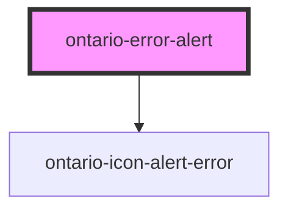

# ontario-error-alert

<!-- Auto Generated Below -->

## Properties

| Property    | Attribute    | Description                                                                                         | Type                  | Default     |
| ----------- | ------------ | --------------------------------------------------------------------------------------------------- | --------------------- | ----------- |
| `controlId` | `control-id` |                                                                                                     | `string`              | `''`        |
| `elementId` | `element-id` | The unique identifier of the element. This is optional - if no ID is passed, one will be generated. | `string \| undefined` | `undefined` |
| `errorId`   | `error-id`   |                                                                                                     | `string`              | `''`        |
| `message`   | `message`    | The text to display for the dropdown list label.                                                    | `string`              | `''`        |

## Dependencies

### Depends on

- [ontario-icon-alert-error](../ontario-icon)

### Graph

---

_Built with [StencilJS](https://stenciljs.com/)_
