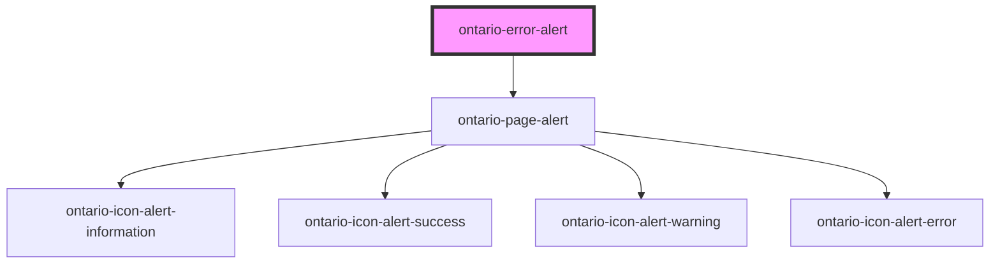

import { useRef } from 'react';
import { OntarioErrorAlert, OntarioInput } from '@ongov/ontario-design-system-component-library-react';
import Tabs from '@theme/Tabs';
import TabItem from '@theme/TabItem';

# ontario-error-alert

Use `ontario-error-alert` to summarize form errors after validation fails. It discovers supported Ontario Design System controls in its associated native form and listens to their existing `inputErrorOccurred` events. Validation and form submission remain the application's responsibility.

## Usage guidance

- Place the alert at the top of the page, above the page's `<h1>`, when possible. Use `form-id` to associate it with a form elsewhere on the page; otherwise, place it inside the native `<form>`.
- Show the alert after client-side or server-side validation finds errors, including when there is only one error.
- Provide an inline error beside each invalid control. Use the same clear, actionable error text in the alert and inline message.
- The application owns validation, submission, setting and clearing errors, and the page title. The alert does not validate controls or maintain a separate application error list.
- Set the page title to indicate that errors need attention, and restore its normal title when errors are resolved.

The alert composes `ontario-page-alert` with `type="error"` for its icon, heading and responsive presentation. Its links take users to the related controls and focus the appropriate native field.

While the alert is active, inline live announcements are suppressed to avoid repeating the same errors. New or changed errors are announced without moving focus. Calling `hide()` restores inline announcements but does not clear control errors.

Use `novalidate` when the application handles validation so browser validation bubbles do not compete with the error alert. Keep entered values after a failed submission and retain server-side validation.

## Configuration

Set `form-id` when the alert is outside its form. The `heading` property customizes the alert heading, and `language` sets the language of its built-in heading and status messages (`en` or `fr`). Application-provided headings and control errors must be localized by the application.

The component exposes three asynchronous methods:

- `show()` activates the alert and focuses it when errors are present. Call it after validation fails; it can also be called before setting control errors.
- `hide()` hides the alert and restores inline announcements. It does not clear errors.
- `refresh()` rediscovers supported controls and reconciles their current errors. Updates are normally detected automatically.

When errors are corrected, clear the relevant control errors and call `hide()` when the alert should no longer be active. A native form reset does not clear application-managed errors, so clear them in the application's reset handler. Do not use a timeout to dismiss the alert.

The alert currently discovers errors from `ontario-input`, `ontario-textarea`, `ontario-dropdown-list`, `ontario-checkboxes`, `ontario-radio-buttons` and `ontario-date-input`. Native controls are not included in the alert.

Whitespace-only control errors remain errors: the native field stays invalid, but the inline message is hidden and the alert omits the entry because it has no accessible link text. A console warning explains the omission. Supply meaningful error text or an empty string to clear the error.

When server-rendering forms, render error content from the server response for users without JavaScript. The alert reconciles supported control errors after hydration but cannot announce them before JavaScript runs. Use stable control IDs when deterministic server/client IDs are required.

### Next.js server-side rendering

In Next.js applications using `@stencil/ssr/next`, generated wrappers are loaded through `next/dynamic`, which does not forward React refs, and the server-rendered placeholder element is replaced when the wrapper chunk loads. Obtain the alert element in the event handler, for example with `document.getElementById('application-error-alert')`, before calling its methods.

## Examples

The following examples show the alert placed before the page heading and associated with the form using `form-id`. In each example, application validation sets the control error after activating the alert.

```mdx-code-block
<Tabs
	defaultValue="html"
	values={[
		{label: 'HTML', value: 'html'},
		{label: 'React', value: 'react'},
		{label: 'Angular', value: 'angular'},
	]}
	groupId="framework"
	queryString="framework">
<TabItem value="html">
```

```html
<ontario-error-alert id="application-error-alert" form-id="application-form"></ontario-error-alert>
<h1>Apply for a service</h1>
<form id="application-form" novalidate>
	<ontario-input id="email" name="email" caption="Email address"></ontario-input>
	<ontario-button html-type="submit" type="primary" label="Continue"></ontario-button>
</form>
<script>
	const form = document.querySelector('#application-form');
	const errorAlert = document.querySelector('ontario-error-alert');
	const email = document.querySelector('#email');

	form.addEventListener('submit', async (event) => {
		event.preventDefault();
		// Replace this check with the application's validation.
		const hasError = !email.value.includes('@');
		if (hasError) {
			await errorAlert.show();
			email.errorMessage = 'Enter an email address in the correct format.';
		} else {
			email.errorMessage = '';
			await errorAlert.hide();
		}
	});
</script>
```

```mdx-code-block
</TabItem>
<TabItem value="react">
```

```tsx
function ApplicationForm() {
	const alertRef = useRef<HTMLOntarioErrorAlertElement>(null);
	const inputRef = useRef<HTMLOntarioInputElement>(null);

	return (
		<>
			<OntarioErrorAlert id="application-error-alert" ref={alertRef} formId="application-form" />
			<h1>Apply for a service</h1>
			<form
				id="application-form"
				noValidate
				onSubmit={async (event) => {
					event.preventDefault();
					// Replace this check with the application's validation.
					const hasError = !inputRef.current?.value?.includes('@');
					if (hasError) {
						await alertRef.current?.show();
						if (inputRef.current) inputRef.current.errorMessage = 'Enter an email address in the correct format.';
					} else {
						if (inputRef.current) inputRef.current.errorMessage = '';
						await alertRef.current?.hide();
					}
				}}
			>
				<OntarioInput ref={inputRef} name="email" caption="Email address" />
				<button type="submit">Continue</button>
			</form>
		</>
	);
}
```

```mdx-code-block
</TabItem>
<TabItem value="angular">
```

```html
<ontario-error-alert #errorAlert id="application-error-alert" form-id="application-form"></ontario-error-alert>
<h1>Apply for a service</h1>
<form id="application-form" novalidate (ngSubmit)="submit()">
	<ontario-input #email name="email" caption="Email address"></ontario-input>
	<button type="submit">Continue</button>
</form>
```

```ts
import { ElementRef, ViewChild } from '@angular/core';

@ViewChild('errorAlert', { read: ElementRef })
errorAlert!: ElementRef<HTMLOntarioErrorAlertElement>;

@ViewChild('email', { read: ElementRef })
email!: ElementRef<HTMLOntarioInputElement>;

async submit() {
	// Replace this check with the application's validation.
	const hasError = !this.email.nativeElement.value?.includes('@');
	if (hasError) {
		await this.errorAlert.nativeElement.show();
		this.email.nativeElement.errorMessage = 'Enter an email address in the correct format.';
	} else {
		this.email.nativeElement.errorMessage = '';
		await this.errorAlert.nativeElement.hide();
	}
}
```

```mdx-code-block
</TabItem>
</Tabs>
```

## Accessibility verification

Automated evidence is in `test/ontario-error-alert.spec.tsx` and `test/ontario-error-alert.e2e.ts`. The unit tests cover error associations, invalid state, snapshots, event updates and focus. Chromium/axe tests cover alert navigation, all six supported ODS controls, form isolation, initial and late errors, dynamic controls, correction and empty states. These tests exercise behaviours relevant to WCAG 1.3.1, 1.3.2, 2.1.1, 2.4.3, 2.4.4, 3.3.1, 4.1.2 and 4.1.3; they do not establish conformance.

Manual assistive technology and visual accessibility testing remains necessary before release. Record browser, operating system and assistive technology versions, along with observed speech and focus results. Verify keyboard-only use, visible and unobscured focus, contrast, forced colours, 200% text resize, 320 CSS-pixel reflow, text spacing and target size. Accessibility-owner review remains required.

<!-- Auto Generated Below -->

## Overview

Collects supported ODS control errors within a native form.
Applications own validation and explicitly activate the summary after validation.

## Properties

| Property   | Attribute  | Description                                                               | Type                  | Default     |
| ---------- | ---------- | ------------------------------------------------------------------------- | --------------------- | ----------- |
| `formId`   | `form-id`  | The ID of the native form whose ODS control errors this summary displays. | `string \| undefined` | `undefined` |
| `heading`  | `heading`  | The summary heading.                                                      | `string \| undefined` | `undefined` |
| `language` | `language` | The language for the built-in heading.                                    | `"en" \| "fr"`        | `'en'`      |

## Methods

### `hide() => Promise<void>`

Hides the summary without clearing control errors and releases inline announcement suppression.
Focus inside the summary returns to its associated control before removal.

#### Returns

Type: `Promise<void>`

### `refresh() => Promise<void>`

Rediscovers associated ODS controls and reconciles their current error snapshots.
Newer refreshes and error events take precedence over pending snapshots.

#### Returns

Type: `Promise<void>`

### `show() => Promise<void>`

Activates aggregation and focuses a non-empty summary without validating controls.
If no errors exist yet, the first arriving error completes activation.

#### Returns

Type: `Promise<void>`

## Dependencies

### Depends on

- [ontario-page-alert](../ontario-page-alert)

### Graph


```mermaid
graph TD;
  ontario-error-alert --> ontario-page-alert
  ontario-page-alert --> ontario-icon-alert-information
  ontario-page-alert --> ontario-icon-alert-success
  ontario-page-alert --> ontario-icon-alert-warning
  ontario-page-alert --> ontario-icon-alert-error
  style ontario-error-alert fill:#f9f,stroke:#333,stroke-width:4px
```

---

_Built with [StencilJS](https://stenciljs.com/)_
