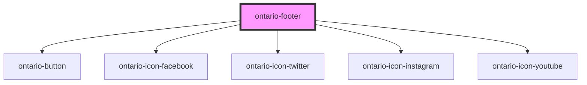

# ontario-footer

Use the simple (`default` type) footer for most applications and subsites. It includes links to accessibility, privacy and copyright information.

Use the expanded (`expandedTwoColumn` and `expandedThreeColumn` type) footer if you need an expanded version of the simple footer. It includes links to additional site-specific information.

## Usage guidance

Please refer to the [Ontario Design System Ontario.ca simple footer](https://designsystem.ontario.ca/components/detail/expanded-footer.html) for current documentation guidance for the simple (default) footer.

Please refer to the [Ontario Design System Application expanded footer](https://designsystem.ontario.ca/components/detail/application-header.html) for current documentation guidance for expanded footers (both two and three column variations).

## Configuration

Once the component package has been installed (see Ontario Design System Component Library for installation instructions), the footer component can be added directly into the project's code, and can be customized by updating the properties outlined [here](#properties). Additional information on custom types for header properties are outlined [here](#custom-property-types). Please see the [examples](#examples) below for how to configure the component.

## Examples

Note that the sample `default-options` for the following examples are the same. Users should be mindful to update links (most notably, the "contactLink") based on the application that is being developed.

Example of a simple (`default` type) footer component.

```html
<ontario-footer
	type="default"
	default-options='{
		"accessibilityLink": "https://www.ontario.ca/page/accessibility",
		"privacyLink": "https://www.ontario.ca/page/privacy-statement",
		"contactLink": "https://www.ontario.ca/feedback/contact-us",
		"printerLink": "https://www.ontario.ca/page/copyright-information"
	}'
></ontario-footer>
```

Example of an expanded footer with two columns (`expandedTwoColumn` type).

```html
<ontario-footer
	type="expandedTwoColumn"
	default-options='{
		"accessibilityLink": "https://www.ontario.ca/page/accessibility",
		"privacyLink": "https://www.ontario.ca/page/privacy-statement",
		"contactLink": "https://www.ontario.ca/feedback/contact-us",
		"printerLink": "https://www.ontario.ca/page/copyright-information"

	}'
	expanded-two-column-options='{
		"firstColumn": {
			"title": "This is the first column heading!",
			"content": "Here is some content for the first column."
		},
		"secondColumn": {
			"title": "This is my second column heading!",
			"content": "Here is some content for the second column.",
			"contactButtonText": "Contact"
		}
	}'
></ontario-footer>
```

Example of an expanded footer with three columns (`expandedThreeColumn` type). In this example, all the possible social media options are included.

```html
<ontario-footer
	type="expandedThreeColumn"
	default-options='{
		"accessibilityLink": "https://www.ontario.ca/page/accessibility",
		"privacyLink": "https://www.ontario.ca/page/privacy-statement",
		"contactLink": "https://www.ontario.ca/feedback/contact-us",
		"printerLink": "https://www.ontario.ca/page/copyright-information"
	}'
	expanded-three-column-options='{
		"firstColumn": {
			"title": "This is my first column heading!",
			"content": "Here is some content for the first column."
		},
		"secondColumn": {
			"title": "This is my second column heading!",
			"content":[
				{
					"title": "Link 1",
					"link": "/link-1"
				},
				{
					"title": "Link 2",
					"link": "/link-2"
				}
			]
		},
		"thirdColumn": {
			"title": "This is my third column heading!",
			"content": "Here is some content for the third column.",
			"facebook": {
				"link": "www.facebook.com"
			},
			"twitter": {
				"link": "www.twitter.com"
			},
			"instagram": {
				"link": "www.instagram.com"
			},
			"youtube": {
				"link": "www.youtube.com"
			}
		}
	}'
></ontario-footer>
```

## Custom property types

### defaultOptions

In most cases, the example default option links displayed below will apply to both Ontario.ca and Ontario.ca subsites. However, developers should be mindful to update the `contactLink` to reflect the correct "Contact Us" page when using this component on a subsite.

<!-- prettier-ignore -->
```html
default-options='{
	"accessibilityLink": "https://www.ontario.ca/page/accessibility",
	"privacyLink": "https://www.ontario.ca/page/privacy-statement",
	"contactLink": "https://www.ontario.ca/feedback/contact-us",
	"printerLink": "https://www.ontario.ca/page/copyright-information"
}'
```

| **Property name**   | **Type** | **Description**                                                 |
| ------------------- | -------- | --------------------------------------------------------------- |
| `accessibilityLink` | `string` | The URL for the accessibility footer link                       |
| `privacyLink`       | `string` | The URL for the privacy footer link                             |
| `contactLink`       | `string` | The URL for the contact us footer link                          |
| `printerLink`       | `string` | The URL for the printer footer link. This property is optional. |

### expandedTwoColumnOptions

<!-- prettier-ignore -->
```html
expanded-two-column-options='{
	"firstColumn": {
		"title": "This is my First Title",
		"content": "This is my first content"
	},
	"secondColumn": {
		"title": "This is my Second Title",
		"content": "This is my second content",
		"contactButtonText": "Button"
	}
}'
```

#### firstColumn object

| **Property name** | **Type** | **Description**                                                          |
| ----------------- | -------- | ------------------------------------------------------------------------ |
| `title`           | `string` | The heading title for the first column of the expanded two column footer |
| `content`         | `string` | The content for the first column of the expanded two column footer       |

#### secondColumn object

| **Property name**   | **Type** | **Description**                                                                         |
| ------------------- | -------- | --------------------------------------------------------------------------------------- |
| `title`             | `string` | The heading title for the second column of the expanded two column footer               |
| `content`           | `string` | The content for the second column of the expanded two column footer                     |
| `contactButtonText` | `string` | The label for the contact button in the second column of the expanded two footer column |

### expandedThreeColumnOptions

For the three column expanded footer, the second column will always display a list of links. These are commonly used to display popular pages a user may need to navigate to quickly. The third column will display content, and optionally display social media links related to the application.

<!-- prettier-ignore -->
```html
expanded-three-column-options='{
	"firstColumn": {
		"title": "This is my First Title",
		"content": "This is my first content"
	},
	"secondColumn": {
		"title": "This is my Second Title",
		"content":[
			{
				"title": "Link 1",
				"link": "/link-1"
			}
		]
	},
	"thirdColumn": {
		"title": "This is my third title",
		"content": "This is my third content",
		"facebook": {
			"link": "www.facebook.com"
		},
		"twitter": {
			"link": "www.twitter.com"
		},
		"instagram": {
			"link": "www.instagram.com"
		},
		"youtube": {
			"link": "www.youtube.com"
		}
	}
}'
```

#### firstColumn object

| **Property name** | **Type** | **Description**                                                            |
| ----------------- | -------- | -------------------------------------------------------------------------- |
| title             | `string` | The heading title for the first column of the expanded three column footer |
| content           | `string` | The content for the first column of the expanded three column footer       |

#### secondColumn object

| **Property name** | **Type** | **Description**                                                                                                                                                                                                                                                |
| ----------------- | -------- | -------------------------------------------------------------------------------------------------------------------------------------------------------------------------------------------------------------------------------------------------------------- |
| title             | `string` | The heading title for the second column of the expanded three column footer                                                                                                                                                                                    |
| content           | `Array`  | The content for the second column of the expanded three column footer takes an Array of Objects, with each object representing a link. The link object takes a `title` (string) for the label for the link, and `link` (string) for the URL value of the link. |

#### thirdColumn

| **Property name** | **Type** | **Description**                                                                      |
| ----------------- | -------- | ------------------------------------------------------------------------------------ |
| title             | `string` | The heading title for the third column of the expanded three column footer           |
| content           | `string` | The content for the third column of the expanded three column footer                 |
| facebook          | `Object` | An optional property where a `link` (string) key is passed in for the Facebook URL.  |
| twitter           | `Object` | An optional property where a `link` (string) key is passed in for the Twitter URL.   |
| instagram         | `Object` | An optional property where a `link` (string) key is passed in for the Instagram URL. |
| youtube           | `Object` | An optional property where a `link` (string) key is passed in for the YouTube URL.   |

<!-- Auto Generated Below -->

## Properties

| Property                     | Attribute                       | Description                                                        | Type                                                        | Default     |
| ---------------------------- | ------------------------------- | ------------------------------------------------------------------ | ----------------------------------------------------------- | ----------- |
| `defaultOptions`             | `default-options`               | Stores the required links for all footers                          | `DefaultOptions \| string`                                  | `undefined` |
| `expandedThreeColumnOptions` | `expanded-three-column-options` | Stores the titles and content for the expanded three column footer | `ExpandedThreeColumnOptions \| string \| undefined`         | `undefined` |
| `expandedTwoColumnOptions`   | `expanded-two-column-options`   | Stores the titles and content for the expanded two column footer   | `ExpandedTwoColumnOptions \| string \| undefined`           | `undefined` |
| `type`                       | `type`                          | Type of footer to be rendered                                      | `"default" \| "expandedThreeColumn" \| "expandedTwoColumn"` | `'default'` |

## Dependencies

### Depends on

- [ontario-button](../ontario-button)
- [ontario-icon-facebook](../ontario-icon)
- [ontario-icon-twitter](../ontario-icon)
- [ontario-icon-instagram](../ontario-icon)
- [ontario-icon-youtube](../ontario-icon)

### Graph



---

_Built with [StencilJS](https://stenciljs.com/)_
