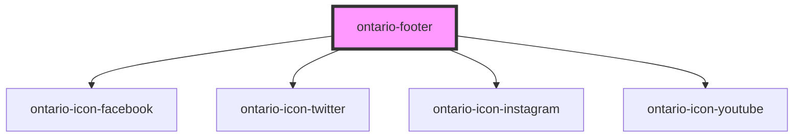

# ontario-footer

<!-- Auto Generated Below -->

## Properties

| Property                     | Attribute                       | Description | Type                                                                                                                                                                      | Default     |
| ---------------------------- | ------------------------------- | ----------- | ------------------------------------------------------------------------------------------------------------------------------------------------------------------------- | ----------- |
| `defaultOptions`             | `default-options`               |             | `defaultOptions \| string`                                                                                                                                                | `''`        |
| `expandedThreeColumnOptions` | `expanded-three-column-options` |             | `expandedThreeColumnOptions \| string \| undefined`                                                                                                                       | `''`        |
| `expandedTwoColumnOptions`   | `expanded-two-column-options`   |             | `expandedTwoColumnOptions \| string \| undefined`                                                                                                                         | `''`        |
| `isExpandedThreeColumn`      | `is-expanded-three-column`      |             | `boolean`                                                                                                                                                                 | `false`     |
| `isExpandedTwoColumn`        | `is-expanded-two-column`        |             | `boolean`                                                                                                                                                                 | `false`     |
| `partnershipConnection`      | `partnership-connection`        |             | `"Funded by Government of Ontario" \| "In partnership with Government of Ontario" \| "Licensed by Government of Ontario" \| "Sponsored by Government of Ontario" \| null` | `null`      |
| `type`                       | `type`                          |             | `"default" \| "expanded" \| "partnership"`                                                                                                                                | `'default'` |

## Dependencies

### Depends on

- [ontario-icon-facebook](../ontario-icon)
- [ontario-icon-twitter](../ontario-icon)
- [ontario-icon-instagram](../ontario-icon)
- [ontario-icon-youtube](../ontario-icon)

### Graph

----------------------------------------------

*Built with [StencilJS](https://stenciljs.com/)*
