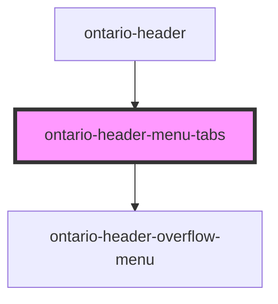

# ontario-header-menu-tabs

<!-- Auto Generated Below -->

## Overview

Ontario Header Menu Tabs Component

- Provides a tabbed navigation interface for mobile/tablet views.
- Displays two tabs (Topics and Sign In) with overflow menu content.
- Manages keyboard navigation, focus trapping, and accessibility.

## Properties

| Property          | Attribute            | Description                                                                         | Type                       | Default     |
| ----------------- | -------------------- | ----------------------------------------------------------------------------------- | -------------------------- | ----------- |
| `autoDetectMode`  | `auto-detect-mode`   | Enable auto-detect handoff mode.                                                    | `boolean \| undefined`     | `false`     |
| `menuButtonRef`   | `menu-button-ref`    | Reference to the menu button that opens this dropdown. Used for focus trapping.     | `HTMLElement \| undefined` | `undefined` |
| `signInMenuItems` | `sign-in-menu-items` | Menu items for the "Sign In" tab. Can be passed as a MenuItem array or JSON string. | `MenuItem[] \| string`     | `undefined` |
| `topicsMenuItems` | `topics-menu-items`  | Menu items for the "Topics" tab. Can be passed as a MenuItem array or JSON string.  | `MenuItem[] \| string`     | `undefined` |

## Events

| Event            | Description                                                            | Type                                        |
| ---------------- | ---------------------------------------------------------------------- | ------------------------------------------- |
| `focusFirstItem` | Event emitted to request overflow menu to focus its first item.        | `CustomEvent<void>`                         |
| `takeOwnership`  | Event emitted when ownership handoff is triggered in auto-detect mode. | `CustomEvent<{ panelId: string \| null; }>` |

## Dependencies

### Used by

- [ontario-header](../ontario-header)

### Depends on

- [ontario-header-overflow-menu](../ontario-header-overflow-menu)

### Graph

---

_Built with [StencilJS](https://stenciljs.com/)_
