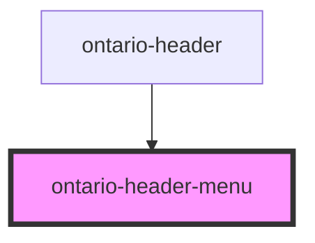

# ontario-header-menu

<!-- Auto Generated Below -->

## Properties

| Property        | Attribute         | Description                                                                                                                                                                                                                                                                   | Type                   | Default     |
| --------------- | ----------------- | ----------------------------------------------------------------------------------------------------------------------------------------------------------------------------------------------------------------------------------------------------------------------------- | ---------------------- | ----------- |
| `menuItems`     | `menu-items`      | The items that will go inside the menu.                                                                                                                                                                                                                                       | `MenuItem[] \| string` | `undefined` |
| `trapMenuFocus` | `trap-menu-focus` | Controls the tab order flow of the menu in relation to the rest of the page. If set to `true`, when a user tabs to the end of the menu, the tab order / focus will be reset to the menu button in the header. If set to `false` the tab order will continue on down the page. | `boolean`              | `true`      |

## Events

| Event              | Description                | Type                   |
| ------------------ | -------------------------- | ---------------------- |
| `endOfMenuReached` | Emitted by `linkIsLast()`. | `CustomEvent<boolean>` |

## Dependencies

### Used by

- [ontario-header](../ontario-header)

### Graph

---

_Built with [StencilJS](https://stenciljs.com/)_
