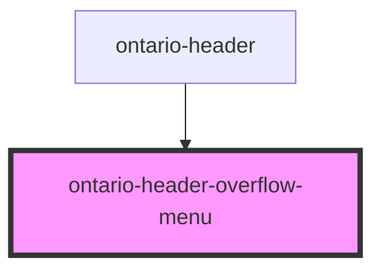

import { OntarioHeaderOverflowMenu } from '@ongov/ontario-design-system-component-library-react';
import useBaseUrl from '@docusaurus/useBaseUrl';

# ontario-header-overflow-menu

This component is intended to be used as a sub-component of the ontario-header component.

## Configuration

Once the component package has been installed (see Ontario Design System Component Library for installation instructions), the ontario-header-overflow-menu component can be added directly into the project's code, and can be customized by updating the properties outlined [here](#properties). Please see the [examples](#examples) below for how to configure the component.

## Examples

```html
<ontario-header-menu-overflow
	menu-items='[
    {
      "title":"Item 1",
      "href":"/item-1"
    },
    {
      "title":"Item 2",
      "href":"/item-2"
    },
    {
      "title":"Item 3",
      "href":"/item-3"
    },
    {
      "title":"Item 4",
      "href":"/item-4"
    },
  ]'
	trap-menu-focus="false"
>
</ontario-header-menu-overflow>
```

<div>
    <OntarioHeaderMenuOverflow
    menu-items='[
      {
        "title":"Item 1",
        "href":"/item-1"
      },
      {
        "title":"Item 2",
        "href":"/item-2"
      },
      {
        "title":"Item 3",
        "href":"/item-3"
      },
      {
        "title":"Item 4",
        "href":"/item-4"
      },
    ]'
    trap-menu-focus='false'
  >
  </OntarioHeaderMenuOverflow>
</div>

<!-- Auto Generated Below -->

## Properties

| Property    | Attribute    | Description                             | Type                   | Default     |
| ----------- | ------------ | --------------------------------------- | ---------------------- | ----------- |
| `menuItems` | `menu-items` | The items that will go inside the menu. | `MenuItem[] \| string` | `undefined` |

## Dependencies

### Used by

- [ontario-header](../ontario-header)

### Graph



---

_Built with [StencilJS](https://stenciljs.com/)_
