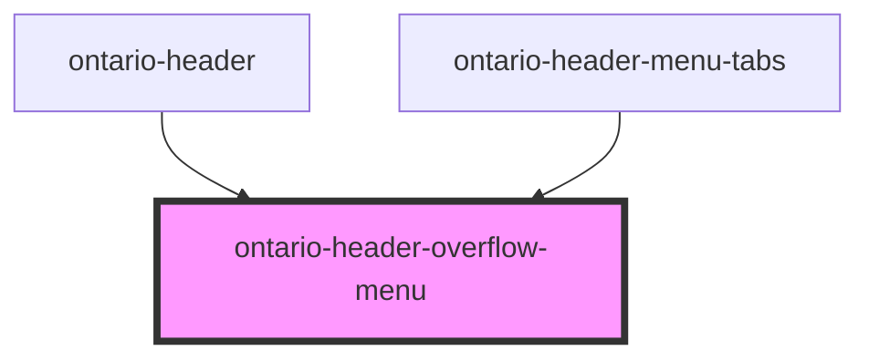

import { OntarioHeaderOverflowMenu } from '@ongov/ontario-design-system-component-library-react';
import useBaseUrl from '@docusaurus/useBaseUrl';

# ontario-header-overflow-menu

This component is intended to be used as a sub-component of the [ontario-header](../ontario-header) component.

## Configuration

Once the component package has been installed (see Ontario Design System Component Library for installation instructions), the ontario-header-overflow-menu component can be added directly into the project's code, and can be customized by updating the properties outlined [here](#properties). Please see the [examples](#examples) below for how to configure the component.

## Examples

```html
<ontario-header-overflow-menu
	menu-items='[
    {
      "title":"Item 1",
      "href":"/item-1"
    },
    {
      "title":"Item 2",
      "href":"/item-2"
    },
    {
      "title":"Item 3",
      "href":"/item-3"
    },
    {
      "title":"Item 4",
      "href":"/item-4"
    },
  ]'
>
</ontario-header-overflow-menu>
```

## Custom property types

### menuItems

The menu items you want to display in the dropdown menu button.

If `linkIsActive` is not set on a menu item, the component will attempt to set the property on a menu item, based on if it's `href` value is included within the URL. If `linkIsActive` is set, it will take **precendence** over the `href` being included within the URL.

If `maxSubheaderLinks` is set within `applicationHeaderInfo` on the `ontario-header` component for an `application` type header, some of these links will be dispersed as links within the subheader menu bar relative to the breakpoint and number set.

```html
<ontario-header
	menu-items='[ 
		{ 
			"title": "Vehicle registration",
			"href": "/vehicle-registration",
			"linkIsActive": "false" 
		}, 
		{ 
			"title": "Driver records",
			"href": "/driver-records", 
			"linkIsActive": "false" 
		}, 
		{ 
			"title": "Accessible Parking Permits", 
			"href": "/accessible-parking-permits", 
			"linkIsActive": "false" 
		}, 
		{ 
			"title": "Highway traveler information", 
			"href": "/highway-traveler-information", 
			"linkIsActive": "true"
		} 
	]'
></ontario-header>
```

| **Property name** | **Type**                 | **Description**                                                                                                                                     |
| ----------------- | ------------------------ | --------------------------------------------------------------------------------------------------------------------------------------------------- |
| `title`           | `string`                 | The title of the menu item (this is what will appear as the label in the header/dropdown menu)                                                      |
| `href`            | `string`                 | The URL for the menu item                                                                                                                           |
| `linkIsActive`    | `boolean`                | A boolean flag for whether or not the current menu item link is active. If set to true, active classes and styles will be applied to the menu item. |
| `onClickHandler`  | `(event: Event) => void` | An optional custom function to add to the menu item. This can be used if any additional logic should happen when the menu item is clicked.          |

<!-- Auto Generated Below -->

## Overview

Overflow Menu Component

Displays a dropdown menu of links. Can operate in two modes:

## Standalone Mode

Used when placed directly in the header (desktop view).

- Manages its own open/close state via `menuButtonToggled` event
- Automatically focuses first menu item when opened
- Sets up focus trap to keep keyboard navigation within menu
- Auto-closes when focus leaves the menu area
- **Emits**: `menuClosed` event when menu closes (for cleanup/state sync)

## Embedded Mode

Used when placed inside `ontario-header-menu-tabs` (mobile/tablet view).

- Parent component controls open/close state
- Parent component manages focus trap
- Menu is always visible when parent tab is active
- **Emits**: `endOfMenuReached` event when Tab is pressed on last item (for focus looping)

**Mode Detection**: Auto-detected based on DOM position (no prop needed).
Checks if ancestor is `ontario-header-menu-tabs` or `.ontario-mobile-menu__panel`.

## Properties

| Property    | Attribute    | Description                                                                                                          | Type                   | Default     |
| ----------- | ------------ | -------------------------------------------------------------------------------------------------------------------- | ---------------------- | ----------- |
| `menuItems` | `menu-items` | The menu items to display. Can be passed as a MenuItem array or JSON string. The items that will go inside the menu. | `MenuItem[] \| string` | `undefined` |

## Events

| Event                  | Description                                                                                            | Type                |
| ---------------------- | ------------------------------------------------------------------------------------------------------ | ------------------- |
| `endOfMenuReached`     | Event emitted when Tab is pressed on the last menu item (embedded mode).                               | `CustomEvent<void>` |
| `focusMenuButton`      | Event emitted when Shift+Tab is pressed on first menu item. Tells the header to focus the menu button. | `CustomEvent<void>` |
| `menuButtonTabPressed` | Event emitted when user Tabs from the menu button. Asks if menu is open and ready to receive focus.    | `CustomEvent<void>` |
| `menuClosed`           | Event emitted when menu closes (standalone mode).                                                      | `CustomEvent<void>` |

## Dependencies

### Used by

- [ontario-header](../ontario-header)
- [ontario-header-menu-tabs](../ontario-header-menu-tabs)

### Graph



---

_Built with [StencilJS](https://stenciljs.com/)_
