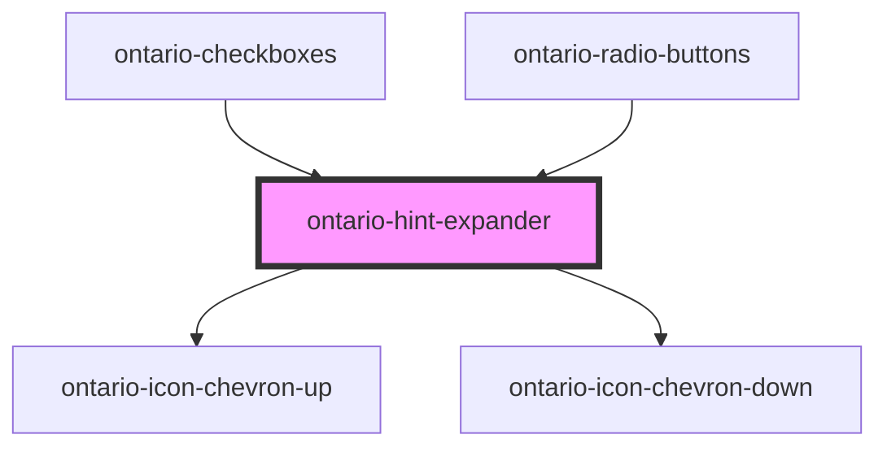

# ontario-hint-expander

A hint expander is a block of hint text that can be shown or hidden using a toggle. 

## Usage guidance

Please refer to the [Ontario Design System](https://designsystem.ontario.ca) for current documentation guidance.

## Configuration

Once the component package has been installed (see Ontario Design System Component Library for installation instructions), the hint expander component can be added directly into the project's code, and can be customized by updating the properties outlined [here](#properties). Please see the [examples](#examples) below for how to configure the component. 

## Examples

Example of a bare-bones hint expander component, the user is passing the `hint` that will be displayed as the question/statement, and the `content` is what is displayed once the hint expander is expanded.

```html
<ontario-hint-expander hint="This is the hint" content="This is the content"></ontario-hint-expander>
```

Example of a hint expander that includes an `aria-label` attribute, and an `element-id` property which is used to establish a relationship between hint text content and elements using the `aria-describedby` attribute. 

```html
<ontario-hint-expander hint="This is the hint" content="This is the content" 
aria-label="This indicates that the hint can be expanded" element-id="expander-82913`"></ontario-hint-expander>
```

## Accessibility

### Usage

In order for hint expanders to have meaningful sequence, they should be added after the associated form element so the user can understand the context of the information.

Since the hint expander information is after the form element, add text in the associated label (only visible to screen readers) to let the user know there is additional context below. 

#### Example: 
```html 
<legend class="ontario-fieldset__legend">
  {this.legend}
  <span class="ontario-label__flag">
    {this.isRequired ? "(required)" : "(optional)"}
  </span>
  <span class="ontario-show-for-sr">More information on (label name) is available in the next element</span>
</legend>
```

### Aria-expanded

When the hint text is in it’s open state, the value in the `aria-expanded` attribute should update to `true`, and when the hint text is in it’s closed state, the value should update to `false`.  This gives screen readers an indication that the hint text is either expanded or collapsed. 

<!-- Auto Generated Below -->


## Properties

| Property    | Attribute    | Description                                                                                                                                                                                                                                     | Type                  | Default     |
| ----------- | ------------ | ----------------------------------------------------------------------------------------------------------------------------------------------------------------------------------------------------------------------------------------------- | --------------------- | ----------- |
| `ariaLabel` | `aria-label` | Include visually hidden text inside the label that describes to screen readers the availability of a hint expander                                                                                                                              | `string \| undefined` | `undefined` |
| `content`   | `content`    | Content to display as the hint, once the expander is toggled open. Please note that any content that is passed into this prop will only be displayed as a string. If you would like to add HTML content, supply child content to the component. | `string`              | `undefined` |
| `elementId` | `element-id` | Used to used to establish a relationship between hint text content and elements using aria-describedby.                                                                                                                                         | `string \| undefined` | `undefined` |
| `hint`      | `hint`       | Text to display as the hint expander question/statement                                                                                                                                                                                         | `string`              | `undefined` |


## Events

| Event                 | Description                                          | Type               |
| --------------------- | ---------------------------------------------------- | ------------------ |
| `toggleExpanderEvent` | Emitted when a keyboard input or mouse event occurs. | `CustomEvent<any>` |


## Dependencies

### Used by

 - [ontario-checkboxes](../ontario-checkbox)
 - [ontario-radio-buttons](../ontario-radio-buttons)

### Depends on

- [ontario-icon-chevron-up](../ontario-icon)
- [ontario-icon-chevron-down](../ontario-icon)

### Graph


----------------------------------------------

*Built with [StencilJS](https://stenciljs.com/)*
