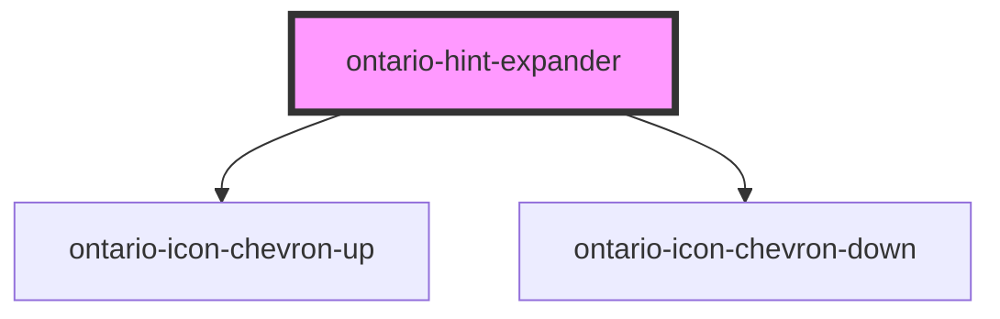

# ontario-hint-expander

<!-- Auto Generated Below -->

## Properties

| Property         | Attribute          | Description                                                                                                        | Type                          | Default     |
| ---------------- | ------------------ | ------------------------------------------------------------------------------------------------------------------ | ----------------------------- | ----------- |
| `ariaLabel`      | `aria-label`       | Include visually hidden text inside the label that describes to screen readers the availability of a hint expander | `null \| string \| undefined` | `undefined` |
| `content`        | `content`          | Content to display as the hint, once the expander is toggled open                                                  | `string`                      | `undefined` |
| `hint`           | `hint`             | Text to display as the hint expander question/statement                                                            | `string`                      | `undefined` |
| `hintExpanderId` | `hint-expander-id` | Used to used to establish a relationship between hint text content and elements using aria-describedby.            | `string \| undefined`         | `undefined` |

## Events

| Event                 | Description                                          | Type               |
| --------------------- | ---------------------------------------------------- | ------------------ |
| `toggleExpanderEvent` | Emitted when a keyboard input or mouse event occurs. | `CustomEvent<any>` |

## Dependencies

### Depends on

- [ontario-icon-chevron-up](../ontario-icon)
- [ontario-icon-chevron-down](../ontario-icon)

### Graph

----------------------------------------------

*Built with [StencilJS](https://stenciljs.com/)*
