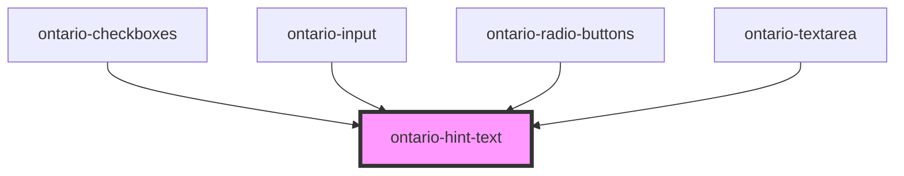

# ontario-hint-text

Use hint text to help users understand how to complete fields in a form. When adding hint text, the first choice should always be to display hint text without using a hint expander. 

## Usage guidance

Please refer to the [Ontario Design System](https://designsystem.ontario.ca) for current documentation guidance.

## Configuration

Once the component package has been installed (see Ontario Design System Component Library for installation instructions), the hint text component can be added directly into the project's code, and can be customized by updating the properties outlined [here](#properties). Please see the [examples](#examples) below for how to configure the component. 

## Examples

Example of a bare-bones hint text component, the user is passing the `hint` directly in the element, which will be displayed as the question/statement.

```html
<ontario-hint-text>This is a hint</ontario-hint-text>
```

Example of a hint text that includes the `hint` property, which will override the `This is a hint` text. The `element-id` property has also been added, which is used to establish a relationship between hint text content and elements using the `aria-describedby` attribute.

```html
<ontario-hint-text hint="This hint will override the hint text provided as Element Content" element-id="hint-293849">This is a hint</ontario-hint-text>
```

## Accessibility

### Usage

If we are adding hint text to our input form, then the input form should have an `aria-describedby` attribute that matches the ID of the hint text. 

<!-- Auto Generated Below -->


## Properties

| Property    | Attribute    | Description                                                                                                                                                            | Type                  | Default     |
| ----------- | ------------ | ---------------------------------------------------------------------------------------------------------------------------------------------------------------------- | --------------------- | ----------- |
| `elementId` | `element-id` | The unique identifier of the element. If no ID is passed, one will be autogenerated.                                                                                   | `string \| undefined` | `undefined` |
| `hint`      | `hint`       | Text to display as the hint text statement.  Setting the hint can be done using the element content or setting the this property.  This property will take precedence. | `string`              | `undefined` |


## Dependencies

### Used by

 - [ontario-checkboxes](../ontario-checkbox)
 - [ontario-input](../ontario-input)
 - [ontario-radio-buttons](../ontario-radio-buttons)
 - [ontario-textarea](../ontario-textarea)

### Graph


----------------------------------------------

*Built with [StencilJS](https://stenciljs.com/)*
