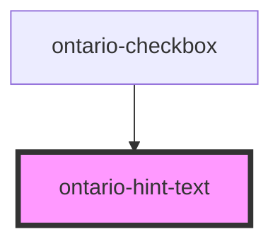

# ontario-hint-text

<!-- Auto Generated Below -->

## Properties

| Property      | Attribute      | Description                                                                                                                                                            | Type                   | Default     |
| ------------- | -------------- | ---------------------------------------------------------------------------------------------------------------------------------------------------------------------- | ---------------------- | ----------- |
| `hint`        | `hint`         | Text to display as the hint text statement.  Setting the hint can be done using the element content or setting the this property.  This property will take precedence. | `string`               | `undefined` |
| `hintId`      | `hint-id`      | Used to used to establish a relationship between hint text content and elements using aria-describedby.                                                                | `string \| undefined`  | `undefined` |
| `inputExists` | `input-exists` | Used to used check if the parent component is a checkbox.                                                                                                              | `boolean \| undefined` | `false`     |

## Dependencies

### Used by

 - [ontario-checkbox](../ontario-checkbox)

### Graph

----------------------------------------------

*Built with [StencilJS](https://stenciljs.com/)*
