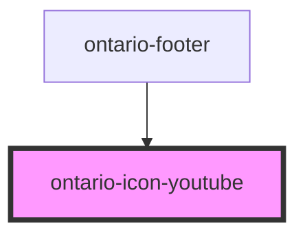

# ontario-icon

Icons are a visual representation of a single and simple object, action or idea. If you need to communicate more complicated concepts, consider an illustration or infographic. 

## Usage guidance

Please refer to the [Ontario Design System](https://designsystem.ontario.ca) for current documentation guidance.

## Configuration

Once the component package has been installed (see Ontario Design System Component Library for installation instructions), the icon component can be added directly into the project's code, and can be customized by updating the properties outlined [here](#properties). Please see the [examples](#examples) below for how to configure the component. Check [here](https://designsystem.ontario.ca/components/detail/icons-primary.html) to see the list of all available primary icons. Check [here](https://designsystem.ontario.ca/components/detail/icons-secondary.html) to see the list of all available secondary icons.

## Examples

Example of a bare-bones icon component, the user is referencing the Ontario Design System's accessibility icon. The default colour will display as black. 

```html
	<ontario-icon-accessibility></ontario-icon-accessibility>
```

Example of a bookmark icon, where the user is is passing a colour property of 'Grey'. 

```html
	<ontario-icon-bookmark colour="grey"> </ontario-icon-bookmark>
```

<!-- Auto Generated Below -->


## Properties

| Property    | Attribute    | Description                                                                                                         | Type                                     | Default   |
| ----------- | ------------ | ------------------------------------------------------------------------------------------------------------------- | ---------------------------------------- | --------- |
| `colour`    | `colour`     | Set the icon's colour.                                                                                              | `"black" \| "blue" \| "grey" \| "white"` | `'black'` |
| `iconWidth` | `icon-width` | The icon width will autogenerate the height since the icons are in square format, thus preserving the aspect ratio. | `24`                                     | `24`      |


## Dependencies

### Used by

 - [ontario-footer](../ontario-footer)

### Graph


----------------------------------------------

*Built with [StencilJS](https://stenciljs.com/)*
