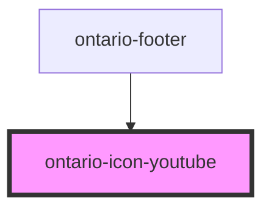

# ontario-icon-accessibility

<!-- Auto Generated Below -->

## Properties

| Property | Attribute | Description | Type                                     | Default   |
| -------- | --------- | ----------- | ---------------------------------------- | --------- |
| `colour` | `colour`  |             | `"black" \| "blue" \| "grey" \| "white"` | `"black"` |

## Dependencies

### Used by

 - [ontario-footer](../ontario-footer)

### Graph

----------------------------------------------

*Built with [StencilJS](https://stenciljs.com/)*
