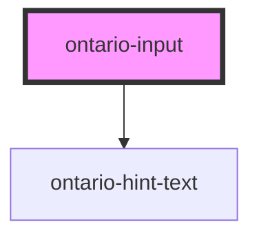

# ontario-input

The ontario-input is an interactive element often used in forms to capture data from the user.

## User Interaction Behaviour

User enters data into the input component.

## Usage guidance

Please refer to the [Ontario Design System](https://designsystem.ontario.ca) for current documentation guidance.

## Examples

Example of a bare-bones input component, the `name` property is passed in for the input, which is used to reference form data after a form is submitted. The `label-caption` property is being provided, which will be displayed as the label. By default, the `label-type` will be `default`, the `input-type` will be `text`, and the input will be set to `optional`.

```html
<ontario-input name="ontario-text-input" label-caption="Ontario input"/></ontario-input>
```

The following input component has the `input-width` property passed in, which will define the width of the input field. The `described-by` property has been passed in because the input has hint text associated with it.

```html
<ontario-input name="ontario-text-input" label-caption="Ontario input" input-width="10-char-width" describedBy="ontario-input-label-example" /><ontario-input></ontario-input>
```

## Accessibility

- An `id` attribute is necessary to allow the input to be associated with a label element
- A `name` attribute needs to be set to be submitted to the server when the form is submitted.

<!-- Auto Generated Below -->

## Properties

<<<<<<< HEAD
| Property | Attribute | Description | Type | Default |
| ------------- | -------------- | ------------------------------------------------------------------------------------------------------------------------------------------------------------------------------------------------------------ | ------------------------------------------------------------------------------------------------------------------------------------------- | ----------- |
| `caption` | `caption` | The text to display as the label | `InputCaption \| string` | `undefined` |
| `describedBy` | `described-by` | The aria-describedBy value if the input has hint text associated with it. | `string \| undefined` | `undefined` |
| `elementId` | `element-id` | The unique identifier of the input. If no ID is passed, one will be autogenerated. | `string \| undefined` | `undefined` |
| `hintText` | `hint-text` | Define hint text for Ontario input. | `string \| undefined` | `undefined` |
| `inputWidth` | `input-width` | The width of the input field. If no value is assigned, it will present as the default input width. | `"10-char-width" \| "2-char-width" \| "20-char-width" \| "3-char-width" \| "4-char-width" \| "5-char-width" \| "7-char-width" \| "default"` | `'default'` |
| `language` | `language` | The language of the component. This is used for translations, and is by default set through event listeners checking for a language property from the header. If none is passed, it will default to English. | `string \| undefined` | `'en'` |
| `name` | `name` | The name assigned to the input.The name value is used to reference form data after a form is submitted. | `string` | `undefined` |
| `required` | `required` | Used to define whether the input field is required or not. | `boolean` | `false` |
| `type` | `type` | The input type value. | `"email" \| "password" \| "tel" \| "text"` | `'text'` |
| `value` | `value` | The input content value. | `string \| undefined` | `undefined` |
=======
| Property | Attribute | Description | Type | Default |
| -------------- | --------------- | -------------------------------------------------------------------------------------------------------------------------- | ------------------------------------------------------------------------------------------------------------------------------------------- | ----------- |
| `describedBy` | `described-by` | The aria-describedBy value if the input has hint text associated with it. | `string \| undefined` | `undefined` |
| `elementId` | `element-id` | The unique identifier of the input. If no ID is passed, one will be autogenerated. | `string \| undefined` | `undefined` |
| `hintExpander` | `hint-expander` | Used to include the Hint Expander component underneath the input box. This is passed in as an object with key-value pairs. | `HintExpander \| string \| undefined` | `undefined` |
| `inputWidth` | `input-width` | The width of the input field. If no value is assigned, it will present as the default input width. | `"10-char-width" \| "2-char-width" \| "20-char-width" \| "3-char-width" \| "4-char-width" \| "5-char-width" \| "7-char-width" \| "default"` | `'default'` |
| `labelCaption` | `label-caption` | The text to display as label. | `string` | `undefined` |
| `labelFor` | `label-for` | The form control with which the caption is associated. | `string \| undefined` | `undefined` |
| `labelType` | `label-type` | The type of label to render. | `"default" \| "heading" \| "large"` | `'default'` |
| `name` | `name` | The name assigned to the input.The name value is used to reference form data after a form is submitted. | `string` | `undefined` |
| `required` | `required` | Used to define whether the input field is required or not. | `boolean` | `false` |
| `type` | `type` | The input type value. | `"email" \| "password" \| "tel" \| "text"` | `'text'` |
| `value` | `value` | The input content value. | `string \| undefined` | `undefined` |

> > > > > > > 5d819109 (fixed merge conflicts)

## Events

| Event         | Description                             | Type                         |
| ------------- | --------------------------------------- | ---------------------------- |
| `blurEvent`   | Emitted when the input loses focus.     | `CustomEvent<void>`          |
| `changeEvent` | Emitted when a keyboard input occurred. | `CustomEvent<KeyboardEvent>` |
| `focusEvent`  | Emitted when the input gains focus.     | `CustomEvent<void>`          |

## Dependencies

### Depends on

- [ontario-hint-text](../ontario-hint-text)

### Graph



---

_Built with [StencilJS](https://stenciljs.com/)_