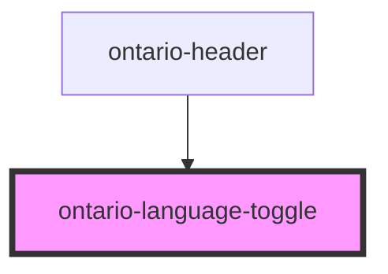

# ontario-language-toggle

This component is used internally to toggle the component languages, set translations and update the HTML lang attribute in the DOM.

It renders an anchor tag (styles as an ontario-button) that accepts either a URL prop to switch the language to, or a custom toggle function if additional functionality is necessary.

It is used in the ontario-header component.

<!-- Auto Generated Below -->

## Properties

| Property               | Attribute                | Description                                                                                                                                                                      | Type                                    | Default     |
| ---------------------- | ------------------------ | -------------------------------------------------------------------------------------------------------------------------------------------------------------------------------- | --------------------------------------- | ----------- |
| `customLanguageToggle` | `custom-language-toggle` | A custom function to pass to the language toggle button. This is optional.                                                                                                       | `((event: Event) => void) \| undefined` | `undefined` |
| `language`             | `language`               | The language of the component. In most cases, the language toggle should be the source of truth for determining the site language. Only pass a language value here if necessary. | `"en" \| "fr" \| undefined`             | `undefined` |
| `size`                 | `size`                   | The size of the language toggle button. If no prop is passed, it will be set to the `default` size.                                                                              | `"default" \| "small" \| undefined`     | `'default'` |
| `url`                  | `url`                    | The URL to change to when the language toggle button is clicked. This is optional.                                                                                               | `string \| undefined`                   | `undefined` |

## Events

| Event                   | Description                                                                                                                                      | Type                                            |
| ----------------------- | ------------------------------------------------------------------------------------------------------------------------------------------------ | ----------------------------------------------- |
| `headerLanguageToggled` | Event that fires when the language toggle is pressed/clicked. The event contains the oldLanguage along with the newLanguage.                     | `CustomEvent<HeaderLanguageToggleEventDetails>` |
| `setAppLanguage`        | Event that fires during the setAppLanguageHandler() method. The event contains the current language (after language logic has already occurred). | `CustomEvent<"en" \| "fr">`                     |

## Dependencies

### Used by

- [ontario-header](../ontario-header)

### Graph

---

_Built with [StencilJS](https://stenciljs.com/)_
