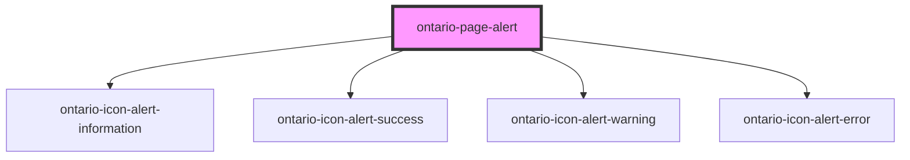

# ontario-page-alert

Use page alerts to notify users of important information or changes on a page. There are four types of page alerts (i.e informational, warning, success and error).

## Usage guidance

Please refer to the [Ontario Design System](https://designsystem.ontario.ca) for current documentation guidance.

## Configuration

Once the component package has been installed (see Ontario Design System Component Library for installation instructions), the Page Alert component can be added directly into the project's code, and can be customized by updating the properties outlined [here](#properties). Please see the [examples](#examples) below for how to configure the component.

<!-- Auto Generated Below -->

## Properties

| Property  | Attribute | Description                                                                                                                                                                                      | Type                                                   | Default           |
| --------- | --------- | ------------------------------------------------------------------------------------------------------------------------------------------------------------------------------------------------ | ------------------------------------------------------ | ----------------- |
| `content` | `content` | Body for page alert. It can be string or HTML content.                                                                                                                                           | `string`                                               | `undefined`       |
| `heading` | `heading` | Heading for page alert                                                                                                                                                                           | `string`                                               | `undefined`       |
| `type`    | `type`    | The type of page alert to render. If no value is provided `informational` alert would be rendered. There are four possible values for page alert (i.e informational, warning, success or error). | `"error" \| "informational" \| "success" \| "warning"` | `'informational'` |

## Dependencies

### Depends on

- [ontario-icon-alert-information](../ontario-icon)
- [ontario-icon-alert-success](../ontario-icon)
- [ontario-icon-alert-warning](../ontario-icon)
- [ontario-icon-alert-error](../ontario-icon)

### Graph

---

_Built with [StencilJS](https://stenciljs.com/)_
