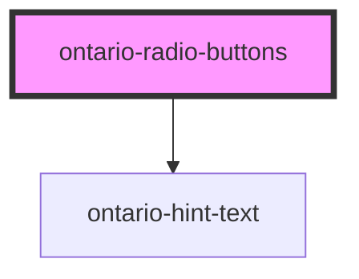

# ontario-radio-button

The ontario-radio-button is an interactive element which allows a user to select a single item from a predefined list of options. 

<br>


## User Interaction Behaviour

User selects a radio button option from a list of radio buttons.

<br>

## Examples

```
<ontario-radio-button name="ontario-radio-button" radio-id="ontario-radio-1" value="Option 1" radio-label="Option 1"></ontario-radio-button>
```

```
<ontario-radio-button name="ontario-radio-button" radio-id="ontario-radio-2" value="Option 2">Option 2</ontario-radio-button>
```

<br>

## Accessibility Considerations

* Do not pre-select radio buttons (there should be no checked attribute by default on the radio button)
* All radio buttons in a group should have the same `name` value to associate them as a group of options

<br>

## Further documentation

See the [Design system radio button guidance](https://designsystem.ontario.ca/components/detail/radio-buttons.html) for current documentation guidelines.

<br>

<!-- Auto Generated Below -->


## Properties

| Property       | Attribute       | Description                                                                                                                                                                                                                                                                                                                                                                                                  | Type                      | Default     |
| -------------- | --------------- | ------------------------------------------------------------------------------------------------------------------------------------------------------------------------------------------------------------------------------------------------------------------------------------------------------------------------------------------------------------------------------------------------------------ | ------------------------- | ----------- |
| `checked`      | `checked`       | The checked attribute of the radio button.  This value is updated through the onChange event handler and by default is set to false.                                                                                                                                                                                                                                                                         | `boolean \| undefined`    | `false`     |
| `hintExpander` | `hint-expander` | Used to include the Hint Expander component underneath the Radio Button Legend. This is passed in as an object with key-value pairs.                                                                                                                                                                                                                                                                         | `HintExpander \| string`  | `undefined` |
| `hintText`     | `hint-text`     | Define hint text on an element.                                                                                                                                                                                                                                                                                                                                                                              | `string \| undefined`     | `undefined` |
| `isRequired`   | `is-required`   | Determine whether the input field is required. If required, it should be set to true.                                                                                                                                                                                                                                                                                                                        | `boolean`                 | `undefined` |
| `legend`       | `legend`        | The legend for the Radio Buttons.                                                                                                                                                                                                                                                                                                                                                                            | `string`                  | `undefined` |
| `name`         | `name`          | * The name assigned to the radio button. The name value is used to reference form data after a form is submitted.                                                                                                                                                                                                                                                                                            | `string`                  | `undefined` |
| `options`      | `options`       | Each property will be passed in through an object in the options array. This can either be passed in as an object directly (if using react), or as a string in HTML. If there are multiple radio buttons in a fieldset, each radio button will be displayed as an option. In the example below, the options are being passed in as a string and there are two radio buttons to be displayed in the fieldset. | `RadioOption[] \| string` | `undefined` |
| `radioId`      | `radio-id`      | The unique identifier of the radio button. If no ID is passed, one will be autogenerated.                                                                                                                                                                                                                                                                                                                    | `string \| undefined`     | `undefined` |
| `radioLabel`   | `radio-label`   | Text to display as the radio button's label  Setting the radio label can be done using the element content or setting the property. This property will take precedence.                                                                                                                                                                                                                                      | `string`                  | `undefined` |
| `required`     | `required`      | Used to define whether the input field is required or not. If required, the value passed should be 'required'.                                                                                                                                                                                                                                                                                               | `boolean \| undefined`    | `false`     |
| `value`        | `value`         | * The radio button content value.                                                                                                                                                                                                                                                                                                                                                                            | `number \| string`        | `undefined` |


## Events

| Event              | Description                           | Type                |
| ------------------ | ------------------------------------- | ------------------- |
| `radioChangeEvent` | * Emitted when the input gains focus. | `CustomEvent<void>` |


## Dependencies

### Depends on

- [ontario-hint-text](../ontario-hint-text)

### Graph


----------------------------------------------

*Built with [StencilJS](https://stenciljs.com/)*
