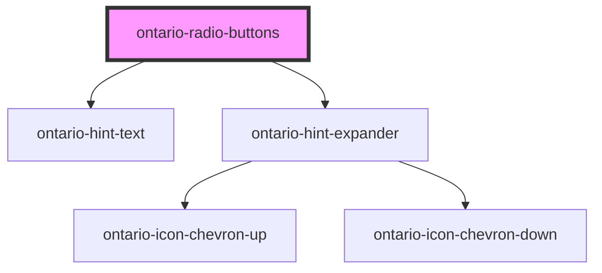

# ontario-radio-button

The ontario-radio-button is an interactive element which allows a user to select a single item from a predefined list of options. 

## User Interaction Behaviour

User selects a radio button option from a list of radio buttons.

## User guidance

Please refer to the [Ontario Design System](https://designsystem.ontario.ca) for current documentation guidance.

## Configuration

Once the component package has been installed (see Ontario Design System Component Library for installation instructions), the radio button component can be added directly into the project's code, and can be customized by updating the properties outlined [here](#properties). Please see the [examples](#examples) below for how to configure the component. 

## Examples

Example of a bare-bones radio button component, the legend for the radio button fieldset is provided, as well as 2 radio options.

```html
  <ontario-radio-buttons
    legend="This is a question?"
    options='[{
        "name": "radio",
        "value": "radio-1",
        "elementId": "radio-1",
        "label": "radio-1-label"
		  },
      {
      	"name": "radio",
        "value": "radio-2",
        "elementId": "radio-2",
        "label": "radio-2-label"
      }
    ]'
  >
  </ontario-radio-buttons>
```

Example of a radio button component with multiple options, a hint text for the entire fieldset, and a hint expander on the individual option. It also has the `is-required` property set to `true`. 

```html
	<ontario-radio-buttons legend="Do you have cats?" hint-text="This is the hint text" is-required options='[{
		"name": "radio",
		"value": "radio",
		"elementId": "radio-1",
		"label": "radio-1-label"
		},
		{
			"name": "radio",
			"value": "radio-2",
			"elementId": "radio-2",
			"label": "radio-2-label",
			"hintExpander": {
				"hint": "Hint expander",
				"content": "This is the content, yup this is the content",
				"aria-label": "This indicates that the hint can be expanded"
			}
		},
		{
			"name": "radio",
			"value": "radio-3",
			"elementId": "radio-3",
			"label": "radio-3-label",
			"hintExpander": {
				"hint": "Hint expander",
				"content": "This is the content",
				"aria-label": "This indicates that the hint can be expanded"
			}
		},
		{
			"name": "radio",
			"value": "radio-4",
			"elementId": "radio-4",
			"label": "radio-4-label"
		}
		]'>
	</ontario-radio-buttons>
```

## Accessibility

- Do not pre-select radio buttons (there should be no checked attribute by default on the radio button)
- All radio buttons in a group should have the same `name` value to associate them as a group of options

<!-- Auto Generated Below -->


## Properties

| Property       | Attribute       | Description                                                                                                                                                                                                                                                                                                                                                                                                  | Type                                  | Default     |
| -------------- | --------------- | ------------------------------------------------------------------------------------------------------------------------------------------------------------------------------------------------------------------------------------------------------------------------------------------------------------------------------------------------------------------------------------------------------------ | ------------------------------------- | ----------- |
| `hintExpander` | `hint-expander` | Used to include the Hint Expander component for the Radio Button fieldset. This is passed in as an object with key-value pairs.                                                                                                                                                                                                                                                                              | `HintExpander \| string \| undefined` | `undefined` |
| `hintText`     | `hint-text`     | Define hint text for Radio Button fieldset.                                                                                                                                                                                                                                                                                                                                                                  | `string \| undefined`                 | `undefined` |
| `isRequired`   | `is-required`   | Determine whether the input field is required. If required, it should be set to true. This can be done by passing in `is-required` to the component.                                                                                                                                                                                                                                                         | `boolean \| undefined`                | `false`     |
| `legend`       | `legend`        | The legend for the Radio Buttons.                                                                                                                                                                                                                                                                                                                                                                            | `string`                              | `undefined` |
| `name`         | `name`          | The name assigned to the radio button. The name value is used to reference form data after a form is submitted.                                                                                                                                                                                                                                                                                              | `string`                              | `undefined` |
| `options`      | `options`       | Each property will be passed in through an object in the options array. This can either be passed in as an object directly (if using react), or as a string in HTML. If there are multiple radio buttons in a fieldset, each radio button will be displayed as an option. In the example below, the options are being passed in as a string and there are two radio buttons to be displayed in the fieldset. | `RadioOption[] \| string`             | `undefined` |


## Dependencies

### Depends on

- [ontario-hint-text](../ontario-hint-text)
- [ontario-hint-expander](../ontario-hint-expander)

### Graph


----------------------------------------------

*Built with [StencilJS](https://stenciljs.com/)*
