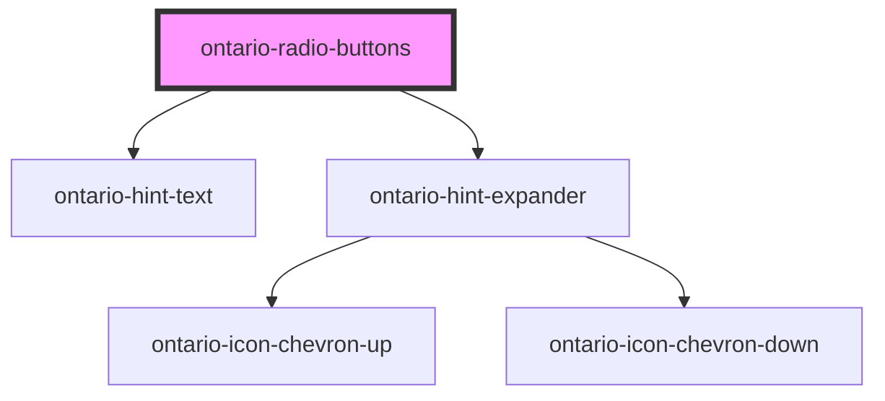

# ontario-radio-button

Use radio buttons when you want the user to select only one option from a list.

## User guidance

Please refer to the [Ontario Design System](https://designsystem.ontario.ca/components/detail/radio-buttons.html) for current documentation guidance.

## Configuration

Once the component package has been installed (see Ontario Design System Component Library for installation instructions), the radio button component can be added directly into the project's code, and can be customized by updating the properties outlined [here](#properties). Additional information on custom types for header properties are outlined [here](#custom-property-types). Please see the [examples](#examples) below for how to configure the component.

## Examples

Example of a bare-bones radio button component, the legend for the radio button fieldset is provided, as well as 2 radio options.

```html
<ontario-radio-buttons
	caption="This is a question?"
	options='[
		{
			"name": "radio",
			"value": "radio-1",
			"elementId": "radio-1",
			"label": "radio-1-label"
		},
		{
			"name": "radio",
			"value": "radio-2",
			"elementId": "radio-2",
			"label": "radio-2-label"
		}
  ]'
>
</ontario-radio-buttons>
```

Example of a radio button component with multiple options, a hint text for the entire fieldset, and a hint expander on the individual option. It also has the `is-required` property set to `true`.

```html
<ontario-radio-buttons
	caption="Do you have cats?"
	hint-text="This is the hint text"
	is-required
	options='[{
		"name": "radio",
		"value": "radio",
		"elementId": "radio-1",
		"label": "radio-1-label"
		},
		{
			"name": "radio",
			"value": "radio-2",
			"elementId": "radio-2",
			"label": "radio-2-label",
			"hintExpander": {
				"hint": "Hint expander",
				"content": "This is the content, yup this is the content"
			}
		},
		{
			"name": "radio",
			"value": "radio-3",
			"elementId": "radio-3",
			"label": "radio-3-label",
			"hintExpander": {
				"hint": "Hint expander",
				"content": "This is the content"
			}
		},
		{
			"name": "radio",
			"value": "radio-4",
			"elementId": "radio-4",
			"label": "radio-4-label"
		}
	]'
>
</ontario-radio-buttons>
```

## Custom property types

### caption

The `caption` property is used to render the legend for the ontario-radio-buttons. It can be passed either a string or an object. If no `captionType` needs to be specified, it can be passed as a string.

```html
caption='{ "captionText": "Radio button legend", "captionType": "default" }'
```

| **Property name** | **Type**                           | **Description**                                                                                                                                          |
| ----------------- | ---------------------------------- | -------------------------------------------------------------------------------------------------------------------------------------------------------- |
| `captionText`     | `string`                           | Text to display as the radio button question                                                                                                             |
| `captionType`     | `"default" \| "large"\| "heading"` | The type of legend to display for the radio button question. This is optional, and if no information is provided, it will default to the `default` type. |

### hintExpander

The `hintExpander` property is used to include the Hint Expander component underneath the radio button legend. This is passed in as an object with key-value pairs.

```html
hintExpander='{ "hint": "This is the hint expander title", "content": "This is the hint expander content - it is only
visible when the hint expander title (hint) is toggled" }'
```

| **Property name** | **Type** | **Description**                                                                                                 |
| ----------------- | -------- | --------------------------------------------------------------------------------------------------------------- |
| `hint`            | `string` | Text to display as the hint expander label/title. When toggled, it will display/hide the `hintExpander` content |
| `content`         | `string` | Text to display as the content of the hint expander                                                             |

### options

| **Property name** | **Type**       | **Description**                                                                                                                                                                                              |
| ----------------- | -------------- | ------------------------------------------------------------------------------------------------------------------------------------------------------------------------------------------------------------ |
| `name`            | `string`       | Text to define the name of radio button groups with the name property (radio buttons with the same name belong to the same group). Note that the name value should be the same for all radio button options. |
| `value`           | `string`       | Text to defines the value associated with the radio button (this is also the value that is sent on submit)                                                                                                   |
| `label`           | `string`       | Text to display as the label of the individual radio option                                                                                                                                                  |
| `elementId`       | `string`       | Text used as the ID for the radio button option. This is used to establish a relationship between radio button labels and the radio input. It must be unique to the radio option.                            |
| `hintExpander`    | `hintExpander` | An optional hint expander to display for the individual radio button option. Information on `hintExpander` properties can be found in the custom property above                                              |

## Accessibility

- Do not pre-select radio buttons (there should be no checked attribute by default on the radio button)
- All radio buttons in a group should have the same `name` value to associate them as a group of options

<!-- Auto Generated Below -->

## Properties

| Property       | Attribute       | Description                                                                                                                                                                                                                                                                                                                                                                                                  | Type                                  | Default     |
| -------------- | --------------- | ------------------------------------------------------------------------------------------------------------------------------------------------------------------------------------------------------------------------------------------------------------------------------------------------------------------------------------------------------------------------------------------------------------ | ------------------------------------- | ----------- |
| `caption`      | `caption`       | The text to display as the label                                                                                                                                                                                                                                                                                                                                                                             | `Caption \| string`                   | `undefined` |
| `hintExpander` | `hint-expander` | Used to include the Hint Expander component for the Radio Button fieldset. This is passed in as an object with key-value pairs. This is optional.                                                                                                                                                                                                                                                            | `HintExpander \| string \| undefined` | `undefined` |
| `hintText`     | `hint-text`     | Define hint text for Radio Button fieldset. This is optional.                                                                                                                                                                                                                                                                                                                                                | `string \| undefined`                 | `undefined` |
| `language`     | `language`      | The language of the component. This is used for translations, and is by default set through event listeners checking for a language property from the header. If none is passed, it will default to English.                                                                                                                                                                                                 | `"EN" \| "FR" \| undefined`           | `'EN'`      |
| `name`         | `name`          | The name assigned to the radio button. The name value is used to reference form data after a form is submitted.                                                                                                                                                                                                                                                                                              | `string`                              | `undefined` |
| `options`      | `options`       | Each property will be passed in through an object in the options array. This can either be passed in as an object directly (if using react), or as a string in HTML. If there are multiple radio buttons in a fieldset, each radio button will be displayed as an option. In the example below, the options are being passed in as a string and there are two radio buttons to be displayed in the fieldset. | `RadioOption[] \| string`             | `undefined` |
| `required`     | `required`      | This is used to determine whether the radio button is required or not. This prop also gets passed to the InputCaption utility to display either an optional or required flag in the label. If no prop is set, it will default to false (optional).                                                                                                                                                           | `boolean \| undefined`                | `false`     |

## Dependencies

### Depends on

- [ontario-hint-text](../ontario-hint-text)
- [ontario-hint-expander](../ontario-hint-expander)

### Graph



---

_Built with [StencilJS](https://stenciljs.com/)_
