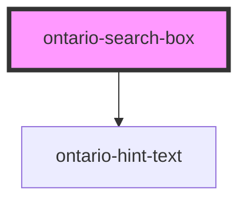

import { OntarioSearchBox } from '@ongov/ontario-design-system-component-library-react';

# ontario-search-box

Use a search box to let users complete keyword-based searches.

## User guidance

Please refer to the [Ontario Design System](https://designsystem.ontario.ca/components/detail/search-box.html) for current documentation guidance.

## Configuration

Once the component package has been installed (see Ontario Design System Component Library for installation instructions), the search box component can be added directly into the project's code, and can be customized by updating the properties outlined [here](#properties). Additional information on custom types for header properties are outlined [here](#custom-property-types). Please see the [examples](#examples) below for how to configure the component.

## Example

### Search box with caption

```html
<ontario-search-box id="ontario-search-box" caption="Search the directory"></ontario-search-box>
```

<div>
    <OntarioSearchBox id="ontario-search-box" caption="Search the directory"></OntarioSearchBox>
</div>

### Handling searching

The `<ontario-search-box>` provides two ways to handle searching.

#### The `performSearch()` function

The `performSearch()` function allows for custom logic to be executed when the search box is submitted for searching. When the search box calls this function internally it will pass to it a string that is the value of the search field. This function is [asynchronous](https://developer.mozilla.org/en-US/docs/Web/JavaScript/Reference/Statements/async_function) and should return a [`Promise<void>`](https://developer.mozilla.org/en-US/docs/Web/JavaScript/Reference/Global_Objects/Promise).

##### Example

The following example registers a simple function on `window` `load` that assigns a custom function to the search box's `performSearch()` function to handle the application specific search logic.

```html
<script>
	window.addEventListener('load', () => {
		console.log('Loaded Search Box Event Listener');

		const searchBox = document.getElementById('ontario-search-box');
		searchBox.performSearch = async (value) => {
			console.log('Performing search with value:', value);
		};
	});
</script>
```

#### Using the `searchOnSubmit` function

As an alternative to using a custom `performSearch()` function the search box also emits an event, `searchOnSubmit` that can be listened to to trigger any custom search logic that is needed. This allows for applications to listen for a search being performed and act accordingly. The value of the search box will be passed via the [`CustomEvent` `detail`](https://developer.mozilla.org/en-US/docs/Web/API/CustomEvent/CustomEvent#detail) property.

##### Example

The following example registers a simple function on `window` `load` that adds an event listener to the search box listening for the `searchOnSubmit` event and outputs the value of the `detail` property.

```html
<script>
	window.addEventListener('load', () => {
		console.log('Loaded Search Box Event Listener');

		const searchBox = document.getElementById('ontario-search-box');
		searchBox.addEventListener('searchOnSubmit', (event) => {
			console.log('Search Event Detail:', event.detail);
		});
	});
</script>
```

## Custom property types

### caption

The `caption` property is used to render the label for the ontario-input. It can be passed either a string or an object. If no `captionType` needs to be specified, it can be passed as a string.

```html
caption='{ "captionText": "Input label", "captionType": "large" }'
```

| Property name | Type                               | Description                                                                                                                                      |
| ------------- | ---------------------------------- | ------------------------------------------------------------------------------------------------------------------------------------------------ |
| `captionText` | `string`                           | Text to display as the input question                                                                                                            |
| `captionType` | `"default" \| "large"\| "heading"` | The type of label to display for the input question. This is optional, and if no information is provided, it will default to the `default` type. |

<!-- Auto Generated Below -->

## Properties

| Property         | Attribute          | Description                                                                                                                                                                                                                                                                                                                                                                            | Type                                                            | Default     |
| ---------------- | ------------------ | -------------------------------------------------------------------------------------------------------------------------------------------------------------------------------------------------------------------------------------------------------------------------------------------------------------------------------------------------------------------------------------- | --------------------------------------------------------------- | ----------- |
| `caption`        | `caption`          | The text to display as the input label                                                                                                                                                                                                                                                                                                                                                 | `Caption \| string`                                             | `undefined` |
| `customOnBlur`   | `custom-on-blur`   | Used to add a custom function to the input onBlur event.                                                                                                                                                                                                                                                                                                                               | `((event: Event) => void) \| undefined`                         | `undefined` |
| `customOnChange` | `custom-on-change` | Used to add a custom function to the input onChange event.                                                                                                                                                                                                                                                                                                                             | `((event: Event) => void) \| undefined`                         | `undefined` |
| `customOnFocus`  | `custom-on-focus`  | Used to add a custom function to the input onFocus event.                                                                                                                                                                                                                                                                                                                              | `((event: Event) => void) \| undefined`                         | `undefined` |
| `customOnInput`  | `custom-on-input`  | Used to add a custom function to the input onInput event.                                                                                                                                                                                                                                                                                                                              | `((event: Event) => void) \| undefined`                         | `undefined` |
| `elementId`      | `element-id`       | The unique identifier of the search-box component. This is optional - if no ID is passed, one will be generated.                                                                                                                                                                                                                                                                       | `string \| undefined`                                           | `undefined` |
| `hintText`       | `hint-text`        | Used to include the ontario-hint-text component for the search-box. This is optional.                                                                                                                                                                                                                                                                                                  | `Hint \| string \| undefined`                                   | `undefined` |
| `language`       | `language`         | The language of the component. This is used for translations. If none is passed, it will default to English.                                                                                                                                                                                                                                                                           | `"en" \| "fr" \| undefined`                                     | `'en'`      |
| `performSearch`  | `perform-search`   | This Function to perform a search operation. This function will be called when the search submit button is triggered. The value argument is used for as search term to use for the search operation. This parameter is optional. The performSearch prop can be set dynamically using JavaScript, allowing you to define custom search functionality when the search form is submitted. | `((value?: string \| undefined) => Promise<void>) \| undefined` | `undefined` |
| `required`       | `required`         | This is used to determine whether the dropdown list is required or not. This prop gets passed to the InputCaption utility to display either an optional or required flag in the label. If no prop is set, it will default to false (optional).                                                                                                                                         | `boolean \| undefined`                                          | `false`     |
| `value`          | `value`            | The value of the search term. This is optional.                                                                                                                                                                                                                                                                                                                                        | `string \| undefined`                                           | `undefined` |

## Events

| Event            | Description                                                                                                       | Type                                                                        |
| ---------------- | ----------------------------------------------------------------------------------------------------------------- | --------------------------------------------------------------------------- |
| `inputOnBlur`    | Emitted when a keyboard input event occurs when an input has lost focus.                                          | `CustomEvent<InputInteractionEvent & { focused: boolean; }>`                |
| `inputOnChange`  | Emitted when a keyboard input or mouse event occurs when an input has been changed.                               | `CustomEvent<{ id?: string \| undefined; value?: string \| undefined; }>`   |
| `inputOnFocus`   | Emitted when a keyboard input event occurs when an input has gained focus.                                        | `CustomEvent<InputInteractionEvent & { focused: boolean; }>`                |
| `inputOnInput`   | Emitted when a input  occurs when an input has been changed.                                                      | `CustomEvent<InputInteractionEvent & { inputType?: string \| undefined; }>` |
| `searchOnSubmit` | Emitted when the search is submitted. Below is an example on how to hook into the event to get the event details. | `CustomEvent<string>`                                                       |

## Dependencies

### Depends on

- [ontario-hint-text](../ontario-hint-text)

### Graph



---

_Built with [StencilJS](https://stenciljs.com/)_
