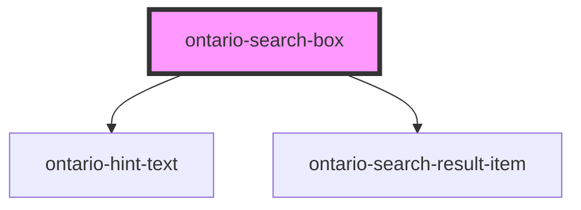

import { OntarioSearchBox } from '@ongov/ontario-design-system-component-library-react';
import Tabs from '@theme/Tabs';
import TabItem from '@theme/TabItem';

# ontario-search-box

Use a search box to let users complete keyword-based searches.

## User guidance

Please refer to the [Ontario Design System](https://designsystem.ontario.ca/components/detail/search-box.html) for current documentation guidance.

### Disabled and read-only states

This component intentionally does not provide `readOnly` or `disabled` props.

Disabling form controls can create accessibility and usability barriers, and often does not explain what the user needs to fix.

Instead:

- keep controls and submission actions available
- validate search requirements in your integration logic and provide contextual feedback

For field-level validation patterns, see the input component [Error messaging](../ontario-input/#error-messaging) guidance.

Source: https://designsystem.ontario.ca/components/detail/buttons.html#disabled-buttons

### Numeric entry and keyboard hints

Use `inputMode` (optionally paired with `pattern`) when a search field is intended for numeric-only queries, such as
searching by a numeric identifier. Like `ontario-input`, these are keyboard/browser hints only and do not perform
validation.

```html
<ontario-search-box caption="Search by file number" input-mode="numeric" pattern="[0-9]*"></ontario-search-box>
```

## Configuration

Once the component package has been installed (see Ontario Design System Component Library for installation instructions), the search box component can be added directly into the project's code, and can be customized by updating the properties outlined [here](#properties). Additional information on custom types for header properties are outlined [here](#custom-property-types). Please see the [example](#example) below for how to configure the component.

## Example

### Search box with caption

```mdx-code-block
<Tabs
	defaultValue="html"
	values={[
		{label: 'HTML', value: 'html'},
		{label: 'React', value: 'react'},
		{label: 'Angular', value: 'angular'},
	]}
	groupId="framework"
	queryString="framework">
<TabItem value="html">
```

```html
<ontario-search-box id="ontario-search-box" caption="Search the directory"></ontario-search-box>
```

```mdx-code-block
</TabItem>
<TabItem value="react">
```

```tsx
<OntarioSearchBox id="ontario-search-box" caption="Search the directory"></OntarioSearchBox>
```

```mdx-code-block
</TabItem>
<TabItem value="angular">
```

```html
<ontario-search-box [id]="'ontario-search-box'" [caption]="'Search the directory'"></ontario-search-box>
```

```mdx-code-block
</TabItem>
</Tabs>
```

<div>
    <OntarioSearchBox id="ontario-search-box" caption="Search the directory"></OntarioSearchBox>
</div>

### Handling searching

The `<ontario-search-box>` provides two ways to handle searching.

#### The `performSearch()` function

The `performSearch()` function allows for custom logic to be executed when the search box is submitted for searching. When the search box calls this function internally it will pass to it a string that is the value of the search field. This function is [asynchronous](https://developer.mozilla.org/en-US/docs/Web/JavaScript/Reference/Statements/async_function) and should return a [`Promise<void>`](https://developer.mozilla.org/en-US/docs/Web/JavaScript/Reference/Global_Objects/Promise).

##### Example

The following example registers a simple function on `window` `load` that assigns a custom function to the search box's `performSearch()` function to handle the application specific search logic.

```html
<script>
	window.addEventListener('load', () => {
		console.log('Loaded Search Box Event Listener');

		const searchBox = document.getElementById('ontario-search-box');
		searchBox.performSearch = async (value) => {
			console.log('Performing search with value:', value);
		};
	});
</script>
```

#### Using the `searchOnSubmit` function

As an alternative to using a custom `performSearch()` function the search box also emits an event, `searchOnSubmit` that can be listened to to trigger any custom search logic that is needed. This allows for applications to listen for a search being performed and act accordingly. The value of the search box will be passed via the [`CustomEvent` `detail`](https://developer.mozilla.org/en-US/docs/Web/API/CustomEvent/CustomEvent#detail) property.

##### Example

The following example registers a simple function on `window` `load` that adds an event listener to the search box listening for the `searchOnSubmit` event and outputs the value of the `detail` property.

```html
<script>
	window.addEventListener('load', () => {
		console.log('Loaded Search Box Event Listener');

		const searchBox = document.getElementById('ontario-search-box');
		searchBox.addEventListener('searchOnSubmit', (event) => {
			console.log('Search Event Detail:', event.detail);
		});
	});
</script>
```

## Autocomplete examples

### Async suggestions with `getSuggestions(query)`

```mdx-code-block
<Tabs
	defaultValue="html"
	values={[
		{label: 'HTML', value: 'html'},
		{label: 'React', value: 'react'},
		{label: 'Angular', value: 'angular'},
	]}
	groupId="framework"
	queryString="framework">
<TabItem value="html">
```

```html
<ontario-search-box
	id="search-with-autocomplete"
	caption="Search Ontario cities"
	enableAutocomplete
></ontario-search-box>

<script>
	window.addEventListener('load', () => {
		const cities = ['Ajax', 'Barrie', 'Belleville', 'Hamilton', 'Ottawa', 'Toronto', 'Waterloo'];
		const searchBox = document.getElementById('search-with-autocomplete');

		searchBox.getSuggestions = async (query) => {
			return cities.filter((city) => city.toLowerCase().includes((query || '').toLowerCase()));
		};
	});
</script>
```

```mdx-code-block
</TabItem>
<TabItem value="react">
```

```tsx
import { useState } from 'react';
import { OntarioSearchBox } from '@ongov/ontario-design-system-component-library-react';

export default function AutocompleteExample() {
	const cities = ['Ajax', 'Barrie', 'Belleville', 'Hamilton', 'Ottawa', 'Toronto', 'Waterloo'];

	const handleGetSuggestions = async (query) => {
		return cities.filter((city) => city.toLowerCase().includes((query || '').toLowerCase()));
	};

	return (
		<OntarioSearchBox
			id="search-with-autocomplete"
			caption="Search Ontario cities"
			enableAutocomplete
			getSuggestions={handleGetSuggestions}
		/>
	);
}
```

```mdx-code-block
</TabItem>
<TabItem value="angular">
```

```typescript
import { Component } from '@angular/core';

@Component({
	selector: 'app-search-autocomplete',
	template: `
		<ontario-search-box
			id="search-with-autocomplete"
			[caption]="'Search Ontario cities'"
			[enableAutocomplete]="true"
		></ontario-search-box>
	`,
})
export class SearchAutocompleteComponent {
	cities = ['Ajax', 'Barrie', 'Belleville', 'Hamilton', 'Ottawa', 'Toronto', 'Waterloo'];

	ngAfterViewInit() {
		const searchBox = document.getElementById('search-with-autocomplete');
		searchBox.getSuggestions = async (query) => {
			return this.cities.filter((city) => city.toLowerCase().includes((query || '').toLowerCase()));
		};
	}
}
```

```mdx-code-block
</TabItem>
</Tabs>
```

### Slotted semantic and custom HTML suggestions

```html
<ontario-search-box id="search-with-slot" caption="Search Ontario cities" enableAutocomplete>
	<ontario-search-result-item slot="suggestions" label="Ajax" value="Ajax"></ontario-search-result-item>
	<ontario-search-result-item slot="suggestions" label="Barrie" value="Barrie"></ontario-search-result-item>
	<div slot="suggestions" data-value="Waterloo" role="option">
		<span data-ontario-search-highlight>Waterloo</span>
		<span class="ontario-search-result-meta">Custom HTML option</span>
	</div>
</ontario-search-box>
```

### Grouping suggestions with static headers

For search results with multiple categories, you can add non-interactive header elements to group suggestions:

```html
<ontario-search-box id="search-grouped" caption="Search Ontario" enableAutocomplete>
	<div slot="suggestions" class="ontario-search-autocomplete__section-header" role="presentation">Cities</div>
	<ontario-search-result-item slot="suggestions" label="Ajax" value="Ajax"></ontario-search-result-item>
	<ontario-search-result-item slot="suggestions" label="Ottawa" value="Ottawa"></ontario-search-result-item>

	<div slot="suggestions" class="ontario-search-autocomplete__section-header" role="presentation">Regions</div>
	<ontario-search-result-item slot="suggestions" label="Durham Region" value="durham"></ontario-search-result-item>
	<ontario-search-result-item slot="suggestions" label="York Region" value="york"></ontario-search-result-item>
</ontario-search-box>
```

### Important notes about autocomplete

Slot content takes precedence over `getSuggestions(query)` when both are supplied.

For custom HTML suggestions, plain text-only options are highlighted automatically. If your custom option contains extra markup, wrap the text that should receive highlighting in an element with `data-ontario-search-highlight`.

Both semantic (`ontario-search-result-item`) and custom HTML options are filtered by the current query in slot mode, and non-matching options are hidden.

## Custom property types

### caption

The `caption` property is used to render the label for the ontario-input. It can be passed either a string or an object. If no `captionType` needs to be specified, it can be passed as a string.

```html
caption='{ "captionText": "Input label", "captionType": "large" }'
```

| Property name | Type                               | Description                                                                                                                                      |
| ------------- | ---------------------------------- | ------------------------------------------------------------------------------------------------------------------------------------------------ |
| `captionText` | `string`                           | Text to display as the input question                                                                                                            |
| `captionType` | `"default" \| "large"\| "heading"` | The type of label to display for the input question. This is optional, and if no information is provided, it will default to the `default` type. |

## Technical Note: SSR (Server-Side Rendering) Considerations

The Ontario Search Box component supports server-side rendering, with a few considerations:

- **Language prop:** Pass `language` explicitly during SSR.
- **Hydrated-only language events:** Avoid relying on `setAppLanguage` or `headerLanguageToggled` for server-rendered output, because these events only fire after hydration.
- **Framework guidance:** For deterministic SSR output, set `language` directly in markup (for example, `<ontario-search-box language="fr"></ontario-search-box>`).

<!-- Auto Generated Below -->

## Overview

Ontario Search Box captures and submits search queries.

This component intentionally does not expose `readOnly` or `disabled` props.

To support accessible and understandable form completion:

- keep form fields and submission actions available
- use validation and error messaging to guide corrections

For component guidance, see:

- https://designsystem.ontario.ca/components/detail/search-box.html
- https://designsystem.ontario.ca/developer-docs/components/ontario-search-box/

Disabled/read-only policy source:

- https://designsystem.ontario.ca/components/detail/buttons.html#disabled-buttons

## Properties

| Property               | Attribute             | Description                                                                                                                                                                                                                                                                                                                                                                            | Type                                                            | Default                                    |
| ---------------------- | --------------------- | -------------------------------------------------------------------------------------------------------------------------------------------------------------------------------------------------------------------------------------------------------------------------------------------------------------------------------------------------------------------------------------- | --------------------------------------------------------------- | ------------------------------------------ |
| `caption` _(required)_ | `caption`             | The text to display as the input label                                                                                                                                                                                                                                                                                                                                                 | `Caption \| string`                                             | `undefined`                                |
| `customOnBlur`         | `custom-on-blur`      | Used to add a custom function to the input onBlur event.                                                                                                                                                                                                                                                                                                                               | `((event: Event) => void) \| undefined`                         | `undefined`                                |
| `customOnChange`       | `custom-on-change`    | Used to add a custom function to the input onChange event.                                                                                                                                                                                                                                                                                                                             | `((event: Event) => void) \| undefined`                         | `undefined`                                |
| `customOnFocus`        | `custom-on-focus`     | Used to add a custom function to the input onFocus event.                                                                                                                                                                                                                                                                                                                              | `((event: Event) => void) \| undefined`                         | `undefined`                                |
| `customOnInput`        | `custom-on-input`     | Used to add a custom function to the input onInput event.                                                                                                                                                                                                                                                                                                                              | `((event: Event) => void) \| undefined`                         | `undefined`                                |
| `debounceMs`           | `debounce-ms`         | Debounce delay in milliseconds before `getSuggestions` is called.                                                                                                                                                                                                                                                                                                                      | `number \| undefined`                                           | `OntarioSearchBox.DEFAULT_DEBOUNCE_MS`     |
| `elementId`            | `element-id`          | The unique identifier of the search-box component. This is optional - if no ID is passed, one will be generated.                                                                                                                                                                                                                                                                       | `string \| undefined`                                           | `undefined`                                |
| `enableAutocomplete`   | `enable-autocomplete` | Enables autocomplete behaviour on the search input.                                                                                                                                                                                                                                                                                                                                    | `boolean \| undefined`                                          | `false`                                    |
| `getSuggestions`       | `get-suggestions`     | Async suggestion provider for autocomplete mode. Slot content has precedence over this callback.                                                                                                                                                                                                                                                                                       | `((query: string) => Promise<Suggestion[]>) \| undefined`       | `undefined`                                |
| `hintText`             | `hint-text`           | Used to include the ontario-hint-text component for the search-box. This is optional.                                                                                                                                                                                                                                                                                                  | `Hint \| string \| undefined`                                   | `undefined`                                |
| `inputMode`            | `input-mode`          | Hints to the browser which virtual keyboard layout to present, such as `numeric` for a numeric-only search query. Accepts the standard `inputmode` values (e.g. `numeric`, `decimal`, `tel`, `email`, `search`). This is a UX hint only - it does not validate or restrict input, and should be paired with `pattern` when constrained entry is required.                              | `string`                                                        | `''`                                       |
| `language`             | `language`            | The language of the component. This is used for translations. If none is passed, it will default to English.                                                                                                                                                                                                                                                                           | `"en" \| "fr" \| undefined`                                     | `'en'`                                     |
| `maxSuggestions`       | `max-suggestions`     | Maximum number of suggestions rendered in async mode.                                                                                                                                                                                                                                                                                                                                  | `number \| undefined`                                           | `OntarioSearchBox.DEFAULT_MAX_SUGGESTIONS` |
| `minChars`             | `min-chars`           | Minimum number of characters required before suggestions are shown.                                                                                                                                                                                                                                                                                                                    | `number \| undefined`                                           | `OntarioSearchBox.DEFAULT_MIN_CHARS`       |
| `pattern`              | `pattern`             | A regular expression the browser can use as a hint when validating input and, on some platforms, to help choose a more appropriate mobile keyboard. This is a browser hint only - it does not replace server-side or component-level validation.                                                                                                                                       | `string \| undefined`                                           | `undefined`                                |
| `performSearch`        | `perform-search`      | This Function to perform a search operation. This function will be called when the search submit button is triggered. The value argument is used for as search term to use for the search operation. This parameter is optional. The performSearch prop can be set dynamically using JavaScript, allowing you to define custom search functionality when the search form is submitted. | `((value?: string \| undefined) => Promise<void>) \| undefined` | `undefined`                                |
| `required`             | `required`            | This is used to determine whether the dropdown list is required or not. This prop gets passed to the InputCaption utility to display either an optional or required flag in the label. If no prop is set, it will default to false (optional).                                                                                                                                         | `boolean \| undefined`                                          | `false`                                    |
| `value`                | `value`               | The value of the search term. This is optional.                                                                                                                                                                                                                                                                                                                                        | `string \| undefined`                                           | `undefined`                                |

## Events

| Event                            | Description                                                                                                       | Type                                                                        |
| -------------------------------- | ----------------------------------------------------------------------------------------------------------------- | --------------------------------------------------------------------------- |
| `autocompleteQueryUpdated`       | Emitted when the autocomplete query changes.                                                                      | `CustomEvent<{ query: string; }>`                                           |
| `autocompleteSuggestionSelected` | Emitted when a suggestion is selected.                                                                            | `CustomEvent<AutocompleteSuggestionSelectedEvent>`                          |
| `autocompleteSuggestionsUpdated` | Emitted after suggestions are updated from either slot content or async mode.                                     | `CustomEvent<{ query: string; count: number; }>`                            |
| `inputOnBlur`                    | Emitted when a keyboard input event occurs when an input has lost focus.                                          | `CustomEvent<InputInteractionEvent & { focused: boolean; }>`                |
| `inputOnChange`                  | Emitted when a keyboard input or mouse event occurs when an input has been changed.                               | `CustomEvent<{ id?: string \| undefined; value?: string \| undefined; }>`   |
| `inputOnFocus`                   | Emitted when a keyboard input event occurs when an input has gained focus.                                        | `CustomEvent<InputInteractionEvent & { focused: boolean; }>`                |
| `inputOnInput`                   | Emitted when a input  occurs when an input has been changed.                                                      | `CustomEvent<InputInteractionEvent & { inputType?: string \| undefined; }>` |
| `searchOnSubmit`                 | Emitted when the search is submitted. Below is an example on how to hook into the event to get the event details. | `CustomEvent<string>`                                                       |

## Dependencies

### Depends on

- [ontario-hint-text](../ontario-hint-text)
- [ontario-search-result-item](../ontario-search-result-item)

### Graph


```mermaid
graph TD;
  ontario-search-box --> ontario-hint-text
  ontario-search-box --> ontario-search-result-item
  style ontario-search-box fill:#f9f,stroke:#333,stroke-width:4px
```

---

_Built with [StencilJS](https://stenciljs.com/)_
