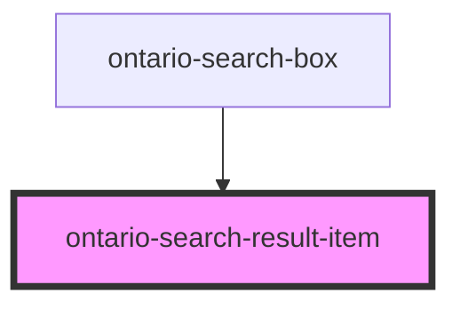

import { OntarioSearchResultItem } from '@ongov/ontario-design-system-component-library-react';
import Tabs from '@theme/Tabs';
import TabItem from '@theme/TabItem';

# ontario-search-result-item

Use `ontario-search-result-item` to render a semantic option row for search suggestions.

## Example

```mdx-code-block
<Tabs
	defaultValue="html"
	values={[
		{label: 'HTML', value: 'html'},
		{label: 'React', value: 'react'},
		{label: 'Angular', value: 'angular'},
	]}
	groupId="framework"
	queryString="framework">
<TabItem value="html">
```

```html
<ontario-search-result-item label="Toronto" description="City in Ontario" value="Toronto"></ontario-search-result-item>
```

```mdx-code-block
</TabItem>
<TabItem value="react">
```

```tsx
<OntarioSearchResultItem label="Toronto" description="City in Ontario" value="Toronto"></OntarioSearchResultItem>
```

```mdx-code-block
</TabItem>
<TabItem value="angular">
```

```html
<ontario-search-result-item
	[label]="'Toronto'"
	[description]="'City in Ontario'"
	[value]="'Toronto'"
></ontario-search-result-item>
```

```mdx-code-block
</TabItem>
</Tabs>
```

## Example with custom slotted content

```html
<ontario-search-result-item value="Toronto">
	<div>
		<strong>Toronto</strong>
		<p>Population: 2.9M</p>
	</div>
</ontario-search-result-item>
```

<!-- Auto Generated Below -->

## Overview

Ontario Search Result Item renders a semantic option row for search suggestions.

For component guidance, see:

- https://designsystem.ontario.ca/components/detail/autocomplete.html

## Properties

| Property      | Attribute     | Description                                                                                    | Type                        | Default     |
| ------------- | ------------- | ---------------------------------------------------------------------------------------------- | --------------------------- | ----------- |
| `active`      | `active`      | Marks the option as active during keyboard navigation (parent-managed).                        | `boolean \| undefined`      | `false`     |
| `description` | `description` | Optional secondary text shown below the label.                                                 | `string \| undefined`       | `undefined` |
| `disabled`    | `disabled`    | Marks the option as disabled and non-interactive.                                              | `boolean \| undefined`      | `false`     |
| `href`        | `href`        | Optional URL to represent a navigable search result.                                           | `string \| undefined`       | `undefined` |
| `label`       | `label`       | Primary text for the suggestion row.                                                           | `string \| undefined`       | `undefined` |
| `language`    | `language`    | Optional language prop to align with component API conventions.                                | `"en" \| "fr" \| undefined` | `'en'`      |
| `segments`    | `segments`    | Ordered label segments used to render matched input text and completion text.                  | `Segment[] \| undefined`    | `undefined` |
| `selected`    | `selected`    | Marks the option as selected (parent-managed).                                                 | `boolean \| undefined`      | `false`     |
| `value`       | `value`       | Optional value used by parent components during selection. Falls back to `label` when not set. | `string \| undefined`       | `undefined` |

## Events

| Event          | Description                                               | Type                                                                                                     |
| -------------- | --------------------------------------------------------- | -------------------------------------------------------------------------------------------------------- |
| `itemSelected` | Emitted when a non-disabled option is selected via click. | `CustomEvent<{ label?: string \| undefined; value?: string \| undefined; href?: string \| undefined; }>` |

## Dependencies

### Used by

- [ontario-search-box](../ontario-search-box)

### Graph



---

_Built with [StencilJS](https://stenciljs.com/)_
