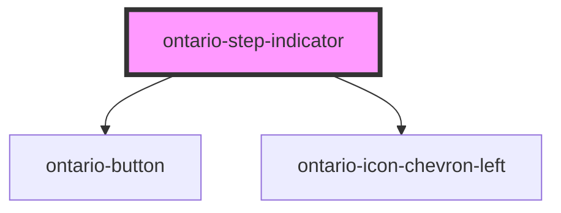

# ontario-step-indicator

<!-- Auto Generated Below -->

## Properties

| Property             | Attribute             | Description                                               | Type                   | Default     |
| -------------------- | --------------------- | --------------------------------------------------------- | ---------------------- | ----------- |
| `backButtonlink`     | `back-buttonlink`     | The link for where the back button should lead.           | `string`               | `undefined` |
| `currentStep`        | `current-step`        | Lets user know which step the current page is on.         | `number \| undefined`  | `1`         |
| `isPercentage`       | `is-percentage`       | Display the text in percentage format.                    | `boolean \| undefined` | `false`     |
| `numberOfStep`       | `number-of-step`      | Number of steps that the form has.                        | `number \| undefined`  | `5`         |
| `percentageComplete` | `percentage-complete` | Percentage of the form that has been completed.           | `number \| undefined`  | `0`         |
| `showBackbutton`     | `show-backbutton`     | Shows back button depending on which step the user is on. | `boolean`              | `false`     |

## Dependencies

### Depends on

- [ontario-button](../ontario-button)
- [ontario-icon-chevron-left](../ontario-icon)

### Graph

---

_Built with [StencilJS](https://stenciljs.com/)_
