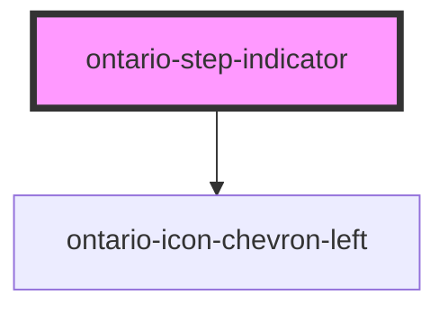

# ontario-step-indicator

<!-- Auto Generated Below -->

## Properties

| Property             | Attribute             | Description                                                                                                                                                                                                   | Type                        | Default |
| -------------------- | --------------------- | ------------------------------------------------------------------------------------------------------------------------------------------------------------------------------------------------------------- | --------------------------- | ------- |
| `currentStep`        | `current-step`        | Lets user know which step the current page is on.                                                                                                                                                             | `number \| undefined`       | `1`     |
| `isPercentage`       | `is-percentage`       | Display the text in percentage format.                                                                                                                                                                        | `boolean \| undefined`      | `false` |
| `language`           | `language`            | The language of the component. This is used for translations, and is by default set through event listeners checking for a language property from the header. If none are passed, it will default to English. | `"en" \| "fr" \| undefined` | `'en'`  |
| `numberOfSteps`      | `number-of-steps`     | Number of steps that the form has.                                                                                                                                                                            | `number \| undefined`       | `5`     |
| `percentageComplete` | `percentage-complete` | Percentage of the form that has been completed.                                                                                                                                                               | `number \| undefined`       | `0`     |
| `showBackButton`     | `show-back-button`    | Shows back button depending on which step the user is on.                                                                                                                                                     | `boolean`                   | `false` |

## Dependencies

### Depends on

- [ontario-icon-chevron-left](../ontario-icon)

### Graph

---

_Built with [StencilJS](https://stenciljs.com/)_
