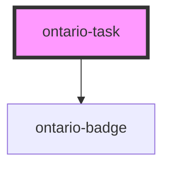

# ontario-task

<!-- Auto Generated Below -->

## Properties

| Property     | Attribute     | Description | Type                  | Default     |
| ------------ | ------------- | ----------- | --------------------- | ----------- |
| `badgeLabel` | `badge-label` |             | `string \| undefined` | `undefined` |
| `hint`       | `hint`        |             | `string \| undefined` | `undefined` |
| `label`      | `label`       |             | `string`              | `undefined` |
| `link`       | `link`        |             | `string \| undefined` | `undefined` |

## Dependencies

### Depends on

- [ontario-badge](../ontario-badge)

### Graph

---

_Built with [StencilJS](https://stenciljs.com/)_
