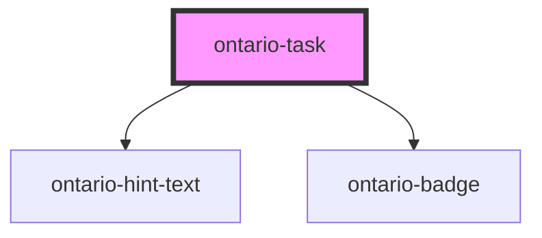

# ontario-task

<!-- Auto Generated Below -->

## Properties

| Property         | Attribute         | Description | Type                                          | Default     |
| ---------------- | ----------------- | ----------- | --------------------------------------------- | ----------- |
| `deactivateLink` | `deactivate-link` |             | `boolean`                                     | `false`     |
| `hintText`       | `hint-text`       |             | `Hint \| string \| undefined`                 | `undefined` |
| `label`          | `label`           |             | `string`                                      | `undefined` |
| `language`       | `language`        |             | `"en" \| "fr" \| undefined`                   | `undefined` |
| `link`           | `link`            |             | `string \| undefined`                         | `undefined` |
| `taskStatus`     | `task-status`     |             | `"completed" \| "inProgress" \| "notStarted"` | `undefined` |

## Dependencies

### Depends on

- [ontario-hint-text](../ontario-hint-text)
- [ontario-badge](../ontario-badge)

### Graph

---

_Built with [StencilJS](https://stenciljs.com/)_
