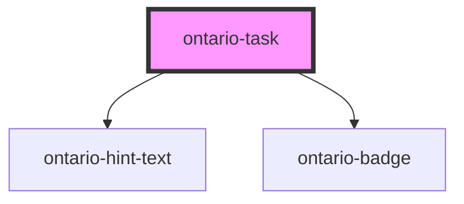

import { OntarioTask } from '@ongov/ontario-design-system-component-library-react';
import Tabs from '@theme/Tabs';
import TabItem from '@theme/TabItem';

# ontario-task

Use a task to show the user activities they have completed and what they have left to do.

## Usage guidance

Please refer to the [Ontario Design System](https://designsystem.ontario.ca/components/detail/task-list.html) for current documentation guidance for tables.

## Configuration

Once the component package has been installed (see Ontario Design System Component Library for installation instructions), the task component can be added directly into the project's code, and can be customized by updating the properties outlined [here](#properties). Additional information on custom types for header properties are outlined [here](#custom-property-types). Please see the [examples](#examples) below for how to configure the component.

## Examples

Example of a bare-bones task.

```mdx-code-block
<Tabs
	defaultValue="html"
	values={[
		{label: 'HTML', value: 'html'},
		{label: 'React', value: 'react'},
		{label: 'Angular', value: 'angular'},
	]}
	groupId="framework"
	queryString="framework">
<TabItem value="html">
```

```html
<ontario-task label="Task" task-id="Task-id" task-status="notStarted" link="https://example.com"></ontario-task>
```

```mdx-code-block
</TabItem>
<TabItem value="react">
```

```tsx
<OntarioTask label="Task" taskId="Task-id" taskStatus="notStarted" link="https://example.com"></OntarioTask>
```

```mdx-code-block
</TabItem>
<TabItem value="angular">
```

```html
<ontario-task
	[label]="'Task'"
	[taskId]="'Task-id'"
	[taskStatus]="'notStarted'"
	[link]="'https://example.com'"
></ontario-task>
```

```mdx-code-block
</TabItem>
</Tabs>
```

<div>
	<OntarioTask label="Task" taskId="Task-id" taskStatus="notStarted" link="https://example.com">
	</OntarioTask>
</div>

Example of a task with a hint.

```mdx-code-block
<Tabs
	defaultValue="html"
	values={[
		{label: 'HTML', value: 'html'},
		{label: 'React', value: 'react'},
		{label: 'Angular', value: 'angular'},
	]}
	groupId="framework"
	queryString="framework">
<TabItem value="html">
```

```html
<ontario-task
	label="Task"
	task-id="Task-id"
	hint-text="A hint for task"
	hint-text-id="task-hint"
	task-status="completed"
	link="https://example.com"
></ontario-task>
```

```mdx-code-block
</TabItem>
<TabItem value="react">
```

```tsx
<OntarioTask
	label="Task"
	taskId="Task-id"
	hintText="A hint for task"
	hintTextId="task-hint"
	taskStatus="completed"
	link="https://example.com"
></OntarioTask>
```

```mdx-code-block
</TabItem>
<TabItem value="angular">
```

```html
<ontario-task
	[label]="'Task'"
	[taskId]="'Task-id'"
	[hintText]="'A hint for task'"
	[hintTextId]="'task-hint'"
	[taskStatus]="'completed'"
	[link]="'https://example.com'"
></ontario-task>
```

```mdx-code-block
</TabItem>
</Tabs>
```

<div>
	<OntarioTask
		label="Task"
		taskId="Task-id"
		hintText="A hint for task"
		hintTextId="task-hint"
		taskStatus="completed"
		link="https://example.com"
	></OntarioTask>
</div>

## Technical Note: SSR (Server-Side Rendering) Considerations

The Ontario Task component is SSR-compatible and renders predictably during hydration. For full consistency:

- **Always pass a valid `taskStatus` prop**. Invalid values will default to 'NotStarted' at runtime.
- **Language Prop:** Language change events only fire in the browser after hydration. To ensure the correct language is rendered during SSR, it's recommended to pass the desired `language` explicitly as a prop (e.g., `<ontario-task language="fr"></ontario-task>`).

### SSR-safe example:

```html
<ontario-task
	label="Confirm email"
	task-id="confirm-email"
	task-status="InProgress"
	heading-level="h3"
	language="fr"
	hint-text="Be sure to use your work email"
></ontario-task>
```

<!-- Auto Generated Below -->

## Properties

| Property         | Attribute         | Description                                                                                                                                                                                                         | Type                                                                                                                                                         | Default                   |
| ---------------- | ----------------- | ------------------------------------------------------------------------------------------------------------------------------------------------------------------------------------------------------------------- | ------------------------------------------------------------------------------------------------------------------------------------------------------------ | ------------------------- |
| `deactivateLink` | `deactivate-link` | Disables the task link when set to `true`. Default is `false`, meaning the link will be active if provided.                                                                                                         | `boolean`                                                                                                                                                    | `false`                   |
| `headingLevel`   | `heading-level`   | Allows consumers to define the heading level for the task label. Accepts 'h2', 'h3' or 'h4'. Default is 'h3'.                                                                                                       | `"h2" \| "h3" \| "h4"`                                                                                                                                       | `'h3'`                    |
| `hintText`       | `hint-text`       | Used to include the ontario-hint-text component for the task. This is optional.                                                                                                                                     | `Hint \| string \| undefined`                                                                                                                                | `undefined`               |
| `label`          | `label`           | Specifies the label of the task. This is required to provide the name of the task.                                                                                                                                  | `string`                                                                                                                                                     | `undefined`               |
| `language`       | `language`        | The language of the component. This is used for translations, and is by default set through event listeners checking for a language property from the header. If no language is passed, it will default to English. | `"en" \| "fr" \| undefined`                                                                                                                                  | `undefined`               |
| `link`           | `link`            | Specifies an optional link associated with the task. If provided, clicking the task will navigate to this URL.                                                                                                      | `string \| undefined`                                                                                                                                        | `undefined`               |
| `taskId`         | `task-id`         | A unique id for the task. This is required.                                                                                                                                                                         | `string`                                                                                                                                                     | `undefined`               |
| `taskStatus`     | `task-status`     | Defines the status of the task, with default set to 'NotStarted'. Accepts values from `TaskStatuses` enum: `NotStarted`, `InProgress`, `Completed`, etc.                                                            | `TaskStatuses.CannotStartYet \| TaskStatuses.Completed \| TaskStatuses.Error \| TaskStatuses.InProgress \| TaskStatuses.NotStarted \| TaskStatuses.Optional` | `TaskStatuses.NotStarted` |

## Dependencies

### Depends on

- [ontario-hint-text](../ontario-hint-text)
- [ontario-badge](../ontario-badge)

### Graph



---

_Built with [StencilJS](https://stenciljs.com/)_
