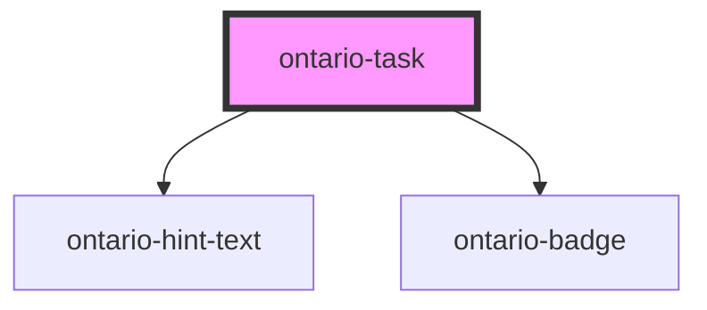

# ontario-task

<!-- Auto Generated Below -->

## Properties

| Property         | Attribute         | Description                                                                                                                                                                                                         | Type                                                                           | Default                   |
| ---------------- | ----------------- | ------------------------------------------------------------------------------------------------------------------------------------------------------------------------------------------------------------------- | ------------------------------------------------------------------------------ | ------------------------- |
| `deactivateLink` | `deactivate-link` | Disables the task link when set to `true`. Default is `false`, meaning the link will be active if provided.                                                                                                         | `boolean`                                                                      | `false`                   |
| `hintText`       | `hint-text`       | Used to include the ontario-hint-text component for the task. This is optional.                                                                                                                                     | `Hint \| string \| undefined`                                                  | `undefined`               |
| `label`          | `label`           | Specifies the label of the task. This is required to provide the name of the task.                                                                                                                                  | `string`                                                                       | `undefined`               |
| `language`       | `language`        | The language of the component. This is used for translations, and is by default set through event listeners checking for a language property from the header. If no language is passed, it will default to English. | `"en" \| "fr" \| undefined`                                                    | `undefined`               |
| `link`           | `link`            | Specifies an optional link associated with the task. If provided, clicking the task will navigate to this URL.                                                                                                      | `string \| undefined`                                                          | `undefined`               |
| `taskStatus`     | `task-status`     | Defines the status of the task, with default set to 'NotStarted'. Accepts values from `TaskStatuses` enum: `NotStarted`, `InProgress`, `Completed`.                                                                 | `TaskStatuses.Completed \| TaskStatuses.InProgress \| TaskStatuses.NotStarted` | `TaskStatuses.NotStarted` |

## Dependencies

### Depends on

- [ontario-hint-text](../ontario-hint-text)
- [ontario-badge](../ontario-badge)

### Graph

---

_Built with [StencilJS](https://stenciljs.com/)_
