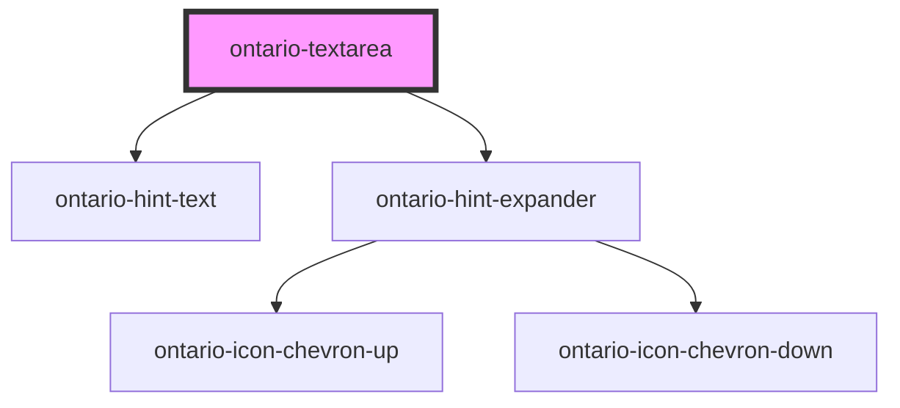

# ontario-textarea

Use a text area when you want the user to enter **more than** a single line of information.

## Usage guidance

Please refer to the [Ontario Design System](https://designsystem.ontario.ca/components/detail/text-areas.html) for current documentation guidance.

## Configuration

Once the component package has been installed (see Ontario Design System Component Library for installation instructions), the textarea component can be added directly into the project's code, and can be customized by updating the properties outlined [here](#properties). Additional information on custom types for header properties are outlined [here](#custom-property-types). Please see the [examples](#examples) below for how to configure the component.

## Examples

Example of a bare-bones textarea component, the user is passing the `name` which is the value used to reference form data after a form is submitted. The `id` is also being passed in as the unique identifier of the textarea.

```html
<ontario-textarea name="comments" id="form-comments" />
```

```html
<ontario-textarea name="comments" id="form-comments" required="true" onBlur="exampleFunction()" />
```

## Custom property types

### caption

The caption property is used to render the legend for the ontario-textarea. It can be passed either a string or an object. If no captionType needs to be specified, it can be passed as a string.

```html
caption='{
	"captionText": "Textarea label",
	"captionType": "default"
}'
```

| **Property name** 	| **Type**                          	| **Description**                                                                                                                                      	|
|-------------------	|-----------------------------------	|------------------------------------------------------------------------------------------------------------------------------------------------------	|
| captionText       	| `string`                            	| Text to display as the radio textarea question                                                                                                             	|
| captionType       	| `"default" \| "large"\| "heading"` | The type of legend to display for the textarea question. This is optional, and if no information is provided, it will default to the "default" type. 	|

### hintExpander

This hintExpander property is used to include the Hint Expander component underneath the input label. This is passed in as an object with key-value pairs.

```html
hintExpander='{ 
	"hint": "This is the hint expander title", 
	"content": "This is the hint expander content - it is only visible when the hint expander title (hint) is toggled" 
}'
```

## Accessibility

- An `id` attribute is necessary to allow the textarea to be associated with a label element
- A `name` attribute needs to be set to be submitted to the server when the form is submitted.

<!-- Auto Generated Below -->

## Properties

| Property       | Attribute       | Description                                                                                                                                                                                                                                    | Type                                  | Default     |
| -------------- | --------------- | ---------------------------------------------------------------------------------------------------------------------------------------------------------------------------------------------------------------------------------------------- | ------------------------------------- | ----------- |
| `caption`      | `caption`       | The text to display as the label                                                                                                                                                                                                               | `Caption \| string`                   | `undefined` |
| `describedBy`  | `described-by`  | The aria-describedBy value if the textarea has hint text associated with it. This is optional.                                                                                                                                                 | `string \| undefined`                 | `undefined` |
| `elementId`    | `element-id`    | The unique identifier of the textarea. This is optional - if no ID is passed, one will be generated.                                                                                                                                           | `string \| undefined`                 | `undefined` |
| `hintExpander` | `hint-expander` | Used to include the Hint Expander component for the textarea. This is passed in as an object with key-value pairs. This is optional.                                                                                                           | `HintExpander \| string \| undefined` | `undefined` |
| `hintText`     | `hint-text`     | Define hint text for Ontario textarea. This is optional.                                                                                                                                                                                       | `string \| undefined`                 | `undefined` |
| `language`     | `language`      | The language of the component. This is used for translations, and is by default set through event listeners checking for a language property from the header. If none is passed, it will default to English.                                   | `string \| undefined`                 | `'en'`      |
| `name`         | `name`          | The name assigned to the textarea. The name value is used to reference form data after a form is submitted.                                                                                                                                    | `string`                              | `undefined` |
| `required`     | `required`      | This is used to determine whether the textarea is required or not. This prop also gets passed to the InputCaption utility to display either an optional or required flag in the label. If no prop is set, it will default to false (optional). | `boolean \| undefined`                | `false`     |
| `value`        | `value`         | The textarea content value.                                                                                                                                                                                                                    | `string \| undefined`                 | `undefined` |

## Events

| Event         | Description                             | Type                         |
| ------------- | --------------------------------------- | ---------------------------- |
| `blurEvent`   | Emitted when the input loses focus.     | `CustomEvent<void>`          |
| `changeEvent` | Emitted when a keyboard input occurred. | `CustomEvent<KeyboardEvent>` |
| `focusEvent`  | Emitted when the input gains focus.     | `CustomEvent<void>`          |

## Dependencies

### Depends on

- [ontario-hint-text](../ontario-hint-text)
- [ontario-hint-expander](../ontario-hint-expander)

### Graph



---

_Built with [StencilJS](https://stenciljs.com/)_
